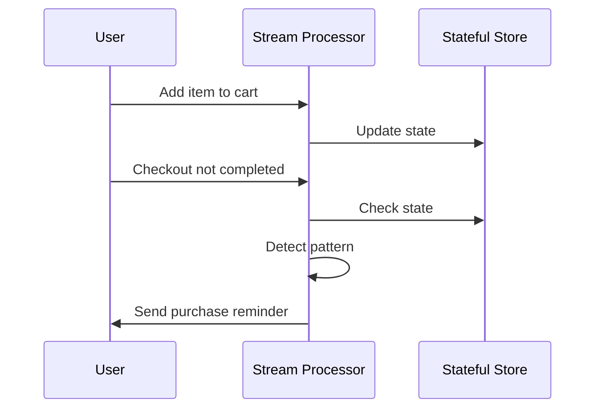

## Introduction

Event Pattern Detection in stream processing involves identifying specific sequences or patterns of events over time. This design pattern is essential for applications that need to recognize complex sequences, such as monitoring user behaviors, fraudulent activities, or system anomalies. By maintaining state information about past events, systems can detect patterns as they unfold and trigger corresponding actions.

## Description

Event Pattern Detection provides the ability to exhaustively analyze streaming data in real-time to detect combinations and sequences of events. It requires maintaining state about incoming events to detect when certain conditions have been met. This pattern is particularly beneficial in scenarios where simple event processing doesn't suffice due to the need to account for order and occurrence over time.

**Example**: A classic example of Event Pattern Detection is tracking e-commerce interactions to identify when a user adds items to their cart but fails to complete a purchase within an hour. By recognizing this sequence, businesses can trigger campaigns or reminders to encourage purchasing behavior.

## Architectural Approaches

1. **Stateful Stream Processing:**
   - Utilize technologies like Apache Kafka Streams or Apache Flink, which provide robust libraries for stateful transformations and pattern detection directly within the streaming pipeline.
   - State is stored and managed as part of the stream processing framework, allowing for efficient retrieval and updates.

2. **Complex Event Processing (CEP):**
   - Systems such as Apache Siddhi or Drools Fusion permit the definition and detection of complex event sequences using event pattern languages.
   - CEP engines are optimized for aggregating data over windows and triggering actions based on defined patterns.

3. **Lambda Architecture:**
   - Combine both real-time stream processing for immediate feedback with batch processing for periodic aggregation and pattern detection.

## Example Code

The following example demonstrates detecting a sequence of user events using Kafka Streams and the Kafka Streams DSL:

```java
StreamsBuilder builder = new StreamsBuilder();
KStream<String, UserEvent> userEvents = builder.stream("user-events");

userEvents
    .groupByKey()
    .windowedBy(TimeWindows.of(Duration.ofHours(1)))
    .aggregate(() -> new UserPurchasePattern(),
               (aggKey, newEvent, pattern) -> pattern.addEvent(newEvent),
               Materialized.<String, UserPurchasePattern>as("patterns-store"))
    .toStream()
    .filter((key, pattern) -> pattern.isRelevant())
    .mapValues(UserPurchasePattern::createAlert)
    .to("alerts-topic");
```

## Diagrams

Here's a UML Sequence Diagram illustrating the event pattern detection process:



## Related Patterns

- **Event Sourcing**: Maintains a complete record of state changes as a sequence of events, providing potential inputs for event pattern detection.
- **CQRS (Command Query Responsibility Segregation)**: Separates the models used for command update actions and query read operations, facilitating complex event pattern detection through dedicated querying mechanisms.
  
## Additional Resources

- [Apache Kafka Streams Documentation](https://kafka.apache.org/documentation/streams/)
- [Apache Flink CEP Library](https://ci.apache.org/projects/flink/flink-docs-stable/docs/libs/cep/)
- [Apache Siddhi Event Stream Processor](https://siddhi.io/)

## Summary

Event Pattern Detection is crucial for applications needing to understand complex behavior or anomalies in stateful streams of data. By leveraging appropriate stream processing technologies and frameworks, systems can efficiently detect and respond to intricate event sequences. This pattern empowers businesses to create intelligent and responsive systems tailored to real-time data insights.
