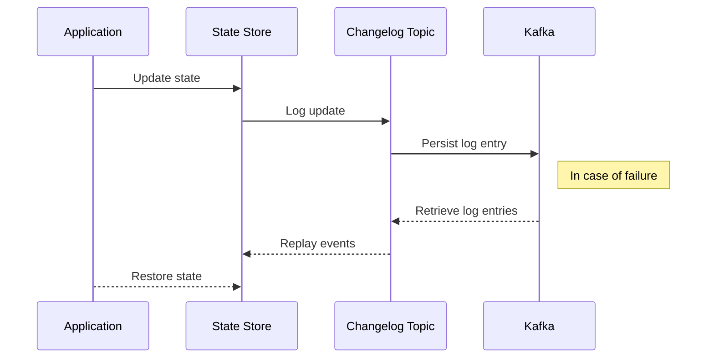

## Introduction to Changelog State Management

Changelog State Management is a vital design pattern for stream processing systems that require durability and fault tolerance. It provides a mechanism to persist changes in the application's state to an external storage system, known as a changelog. This pattern is essential for systems where it is crucial to recover state in the event of system crashes or restarts.

In a distributed environment, maintaining consistency and reliability becomes more complex. Changelog State Management addresses these challenges by ensuring that each change to the state is logged, allowing the system to recover to its last known good state.

## Design Pattern Overview

### Key Concepts

- **Changelog**: A log that records every change to the state. This log is typically stored in a distributed and durable messaging system.
- **State Store**: A component that holds the current state of the application. The changelog is a persistent backup of this state store.

### How It Works

1. **State Update**: Every time the application state is modified, the change is immediately recorded in the state store and logged to the changelog.
2. **Backup**: The changelog acts as a persistent backup. If a failure occurs, the application can rebuild its state by replaying the events from the changelog.
3. **Recovery**: On system restart or crash recovery, the state is reconstructed by applying updates from the changelog to an initially empty state store.

### Example Implementation

#### Kafka Streams

Kafka Streams provides a practical implementation of the Changelog State Management pattern:
- **State Stores and Changelog Topics**: Each state store in a Kafka Streams application is associated with a changelog topic that Kafka itself manages.
- **Automatic Backup**: Kafka Streams ensures that updates to state stores are automatically written to their corresponding changelog topics.
- **Fault Tolerance and Recovery**: The application leverages these changelog topics for automatic state recovery, making the process seamless for developers.

### Mermaid UML Sequence Diagram

Here's a sequence diagram illustrating the Changelog State Management flow in a system using Kafka Streams:

## Related Patterns

- **Event Sourcing**: Maintains an immutable sequence of past events that can re-create the current state by replaying.
- **CQRS (Command Query Responsibility Segregation)**: Segregates the methods that alter state from the methods that retrieve state.

## Best Practices

- **Consistency of Changelog**: Use a messaging system that guarantees at-least-once delivery to ensure that no state updates are lost.
- **Scalability**: Design the system to partition states and their corresponding changelogs effectively.
- **Monitoring and Alerts**: Implement monitoring to detect failures quickly and alert operators to potential data consistency issues.

## Additional Resources

- [Understanding Kafka's Changelog Topics](https://kafka.apache.org/23/documentation/streams/architecture)
- [Stateful Stream Processing with Kafka Streams](https://kafka.apache.org/23/documentation/streams/)
- [Recoverable State Machines](https://martinfowler.com/bliki/TransactionalProcessManager.html)

## Summary

The Changelog State Management pattern is a robust strategy for achieving fault tolerance and state persistence in distributed stream processing applications. By leveraging external changelogs, systems can efficiently recover from failures, ensuring high availability and data consistency across distributed architectures. Whether using tools like Kafka Streams or designing a custom solution, this pattern provides the necessary backbone for resilient stateful processing.
