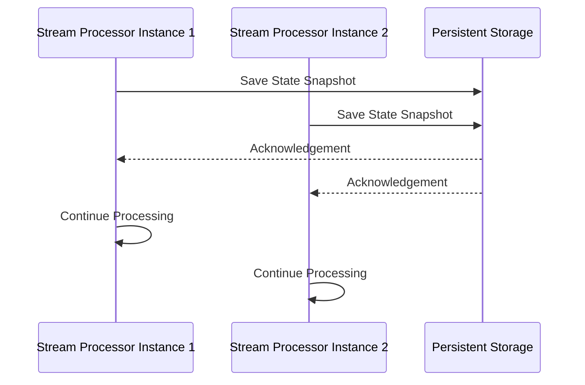

## Introduction

State Snapshots are a crucial design pattern in stream processing and stateful systems, designed to periodically save the transient state to a persistent storage. This ensures quick recovery and reduces the probability of data loss in case of a system failure. This pattern is especially useful in scenarios where applications require consistent state recovery and robust fault tolerance.

## Benefits

- **Fault Tolerance**: By periodic snapshotting, applications can restart with minimal data loss.
- **Quick Recovery**: Reduces the recovery time by avoiding full data reprocessing from the beginning.
- **Consistency**: Ensures state consistency across distributed systems.

## Architectural Approach

1. **Regular Intervals**: Schedule checkpoints at regular intervals to create state snapshots.
2. **Consistency Model**: Ensure snapshots are taken consistently across all components of a distributed system to maintain correctness.
3. **Storage Efficiency**: Use efficient serialization and compression methods for snapshots to minimize storage overhead.
4. **State Management**: Organize state in a way that facilitates partial updates and efficient storage.

## Example Code

Let’s illustrate with an example using Apache Flink, a popular framework for stateful streaming applications, where state snapshots are saved to HDFS:

```java
import org.apache.flink.api.common.state.CheckpointedFunction;
import org.apache.flink.api.common.state.ListState;
import org.apache.flink.api.common.state.ListStateDescriptor;
import org.apache.flink.streaming.api.checkpoint.CheckpointedAsynchronously;
// Other import statements

public class SnapshottingFunction implements MapFunction<String, String>, CheckpointedFunction {
    private transient ListState<Long> checkpointedState;
    private long processedRecordsCount;

    @Override
    public String map(String value) {
        // Process data
        processedRecordsCount++;
        return value.toUpperCase();
    }

    @Override
    public void snapshotState(FunctionSnapshotContext context) throws Exception {
        checkpointedState.clear();
        checkpointedState.add(processedRecordsCount);
    }

    @Override
    public void initializeState(FunctionInitializationContext context) throws Exception {
        ListStateDescriptor<Long> descriptor = new ListStateDescriptor<>(
            "processedRecordsCount",
            Long.class
        );
        checkpointedState = context.getOperatorStateStore().getListState(descriptor);

        if (context.isRestored()) {
            for (Long count : checkpointedState.get()) {
                processedRecordsCount = count;
            }
        }
    }
}
```

## Diagrams

Here's how a state snapshot process might work in a distributed stream processing application, represented using a Mermaid Sequence Diagram:



## Related Patterns

- **Event Sourcing**: Captures changes as a sequence of events, ideal for restoring complete application state.
- **CQRS (Command Query Responsibility Segregation)**: Separates command sending state changes from querying current state.
- **Rollback & Retry**: Mechanism to revert to last known good state and retry operations.

## Additional Resources

- [Apache Flink Documentation on State Management](https://flink.apache.org/docs/stable/) 
- [Google’s Cloud Dataflow Checkpointing Techniques](https://cloud.google.com/dataflow/docs)

## Summary

State Snapshots are integral to maintaining data integrity and system reliability in distributed, stateful processing environments. By reducing the recovery time and minimizing data loss, they enable applications to provide consistent service even in the face of unexpected failures. While implementing this pattern, one should carefully design the snapshot frequency and ensure efficient storage handling to balance performance and resource usage.
