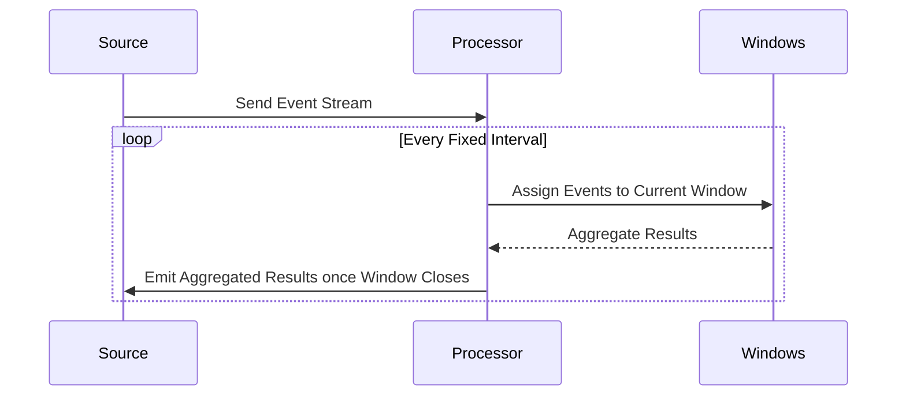

## Introduction
Tumbling Windows are a crucial pattern in stream processing, where data is processed in fixed-size, non-overlapping intervals. Unlike sliding windows, tumbling windows ensure that every piece of data belongs to exactly one window, simplifying the computation of aggregates.

## Detailed Explanation
Tumbling Windows segment continuous data streams into discrete, contiguous chunks based on time intervals, item counts, or session signals. They are pivotal in applications where time-based data aggregation is required, such as data analytics, monitoring, or transaction processing.

### Characteristics
- **Fixed-size**: Every window has the same duration or count of elements.
- **Non-overlapping**: Each event is processed exactly once in one window.
- **Contiguous**: Windows are back-to-back with no gaps between them.
  
### Architectural Approach
In a distributed system, a central component (often a stream processor) defines the windowing strategy. Events arriving at the processor are assigned to a window based on their timestamps. The processor maintains state for each window until it closes, collecting events and performing aggregations or calculations as defined.

### Example Code

Here's a simple example using Apache Flink, a popular stream processing framework:

```scala
import org.apache.flink.streaming.api.scala._
import org.apache.flink.streaming.api.windowing.time.Time

val env = StreamExecutionEnvironment.getExecutionEnvironment

val text: DataStream[String] = env.socketTextStream("localhost", 9999)

val windowCounts = text
  .flatMap(_.split("\\s"))
  .map((_, 1))
  .keyBy(0)
  .timeWindow(Time.minutes(1)) // Tumbling window of 1 minute
  .sum(1)

windowCounts.print()

env.execute("Tumbling Window Example")
```

### Diagrams



## Related Patterns
- **Sliding Windows**: Allow overlapping between consecutive windows, where each event can be processed in multiple windows.
- **Session Windows**: Dynamically sized windows based on session activity with gaps determining their closure.

## Additional Resources
- [Apache Flink Windows Documentation](https://ci.apache.org/projects/flink/flink-docs-stable/dev/stream/operators/windows.html)
- "Streaming Systems" by Tyler Akidau et al. - Offers comprehensive coverage of streaming concepts and windowing strategies. 

## Summary
Tumbling Windows provide a straightforward approach to continuous data processing, especially suited for fixed-interval aggregations. By categorizing data into distinct time chunks, they enable effective and non-redundant data analysis, crucial for real-time analytics and monitoring systems.
