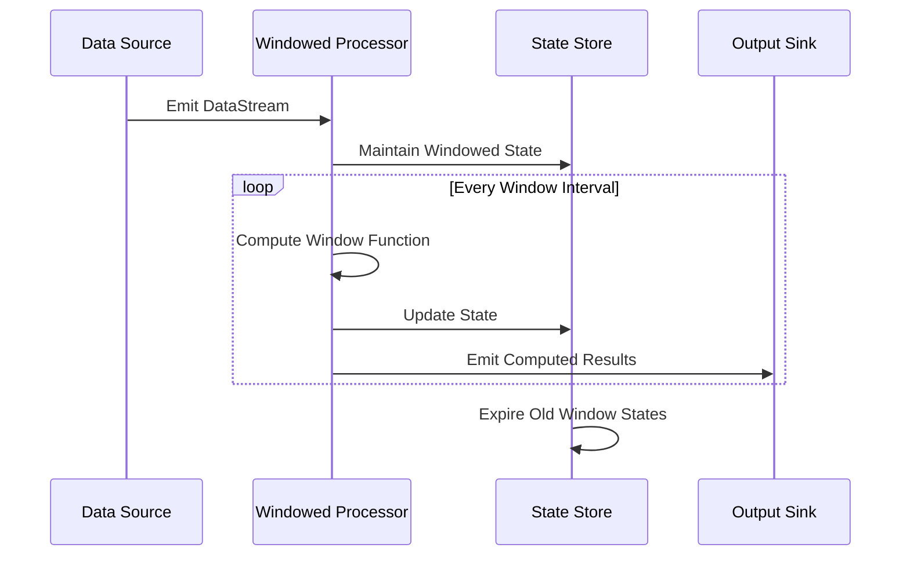

## Windowed State Management

Windowed State Management is a stream processing pattern that focuses on maintaining state specific to each window instance. It enables tailored computations for each window while also ensuring timely state clean-up upon window expiration. 

### Detailed Explanation

In stream processing, data often needs to be accumulated and processed over time windows, such as minutes or hours. For these operations, separate states must be maintained for each window to avoid erroneous computations. Windowed State Management allows for this by associating state with individual windows, making it possible to:

- Aggregate data for each window independently, for example, counting page visits per minute.
- Manage and maintain state efficiently by evicting expired window states.
- Tailor operations specifically to each window, supporting complex event processing.

#### State Storage and Management

State can be stored using various backends such as in-memory, disk-backed, or distributed stores like Apache Flink's state backend or Kafka Streams. Important considerations include:

- **State Size**: Optimize for small state size to reduce storage overhead.
- **Checkpointing**: Implement checkpoints to ensure state persistence and recovery.
- **Window Assignment**: Define time-based or count-based windows depending on the use case.

### Example Scenario

Consider the scenario of tracking user activity in an online service for sending targeted notifications:

```scala
// Example using Apache Flink for a tumbling time window
val stream: DataStream[UserActivity] = ...

val windowedStream = stream.keyBy(_.userId)
  .timeWindow(Time.minutes(5))
  .process(new ProcessWindowFunction[UserActivity, UserNotification, String, TimeWindow] {
    override def process(key: String, context: Context, elements: Iterable[UserActivity], out: Collector[UserNotification]): Unit = {
      val activeUsers = elements.map(_.getUserId).toSet
      out.collect(UserNotification(activeUsers, context.window.getEnd))
    }
  })
```

In the above example, the state contains a list of active users within a 5-minute window, and a notification is sent once the window closes.

### Diagrams

#### Mermaid UML Sequence Diagram

Below is a sequence diagram illustrating the flow of events through windowed state management:



### Related Patterns

- **Event Time Processing**: Utilizes timestamps attached to events for window assignments.
- **Watermarking**: Helps handle late-arriving data by marking the progress of event time in the stream.
- **Window Triggering**: Defines when window computations should be triggered (e.g., after a specific period).

### Additional Resources

- [Stream Processing with Apache Flink](https://flink.apache.org/)
- [Confluent's Kafka Streams documentation](https://docs.confluent.io/)
- [Google Cloud Dataflow](https://cloud.google.com/dataflow/)

### Summary

Windowed State Management is crucial for efficient real-time streaming applications, providing the ability to process data as it arrives, window by window. By assigning state to individual window instances, applications can perform accurate computations and clean up states promptly upon window expiry, enhancing performance and reducing resource consumption. This pattern is particularly relevant in high-throughput systems requiring fine-grained control over data processing.
