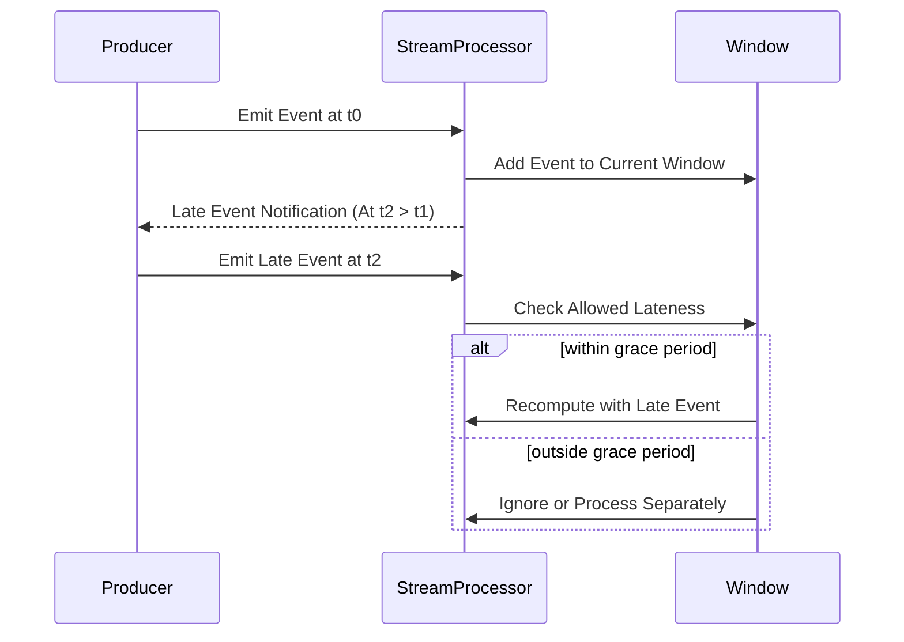

Late data handling is an essential approach in stream processing where data may not arrive in the expected sequence due to network delays, system latencies, or other factors. This pattern allows systems to accommodate this late-arriving data efficiently, ensuring accurate and complete computations.

## Architectural Approach

In stream processing, windows are used to group data streams into finite chunks for computation. However, data does not always arrive in the precise order, potentially resulting in inaccuracies if late arrivals are not considered. Late data handling solves this by:

- Configuring time-based windows with a *grace period*, defining how long the system should wait for late-arriving data after a window's end.
- Re-computing or updating results when late data fits within this tolerance window.

### Key Components

1. **Window Definition**: Specify window size and grace period. For example, a 5-minute tumbling window with a 2-minute grace period.

2. **State Management**: Store intermediate results and be ready to update when late data arrives.

3. **Event Time vs. Processing Time**: Utilize the event-time paradigm instead of processing-time to determine when to process data, enhancing accuracy.

## Best Practices

- **Define Appropriate Grace Periods**: Based on expected delays, application tolerance, and requirements.
  
- **Consistent Clock Synchronization**: Ensure clock synchronization across data producing and processing systems for reliable event-time operations.

- **Asynchronous Handling**: Use asynchronous or parallel processing to maintain overall system responsiveness.

## Example Code

Here's a conceptual example in Apache Flink:

```java
// Define a window with late data handling
DataStream<Event> events = ...;

events.assignTimestampsAndWatermarks(new AscendingTimestampExtractor<Event>() {
    @Override
    public long extractAscendingTimestamp(Event element) {
        return element.getEventTime();
    }
})
.window(TumblingEventTimeWindows.of(Time.minutes(5)))
.allowedLateness(Time.minutes(2))  // Configure grace period
.sideOutputLateData(lateOutputTag)
.process(new ProcessWindowFunction<Event, Result, String, TimeWindow>() {
    @Override
    public void process(String key, Context context, Iterable<Event> elements, Collector<Result> out) {
        // Implement computation considering late data,
        // e.g., recompute aggregates.
    }
});
```

## Diagrams

Here's a Mermaid sequence diagram representing the flow of a late data handling process:



## Related Patterns

- **Watermarking**: A mechanism that helps determine when to consider a window as complete.
- **Out-of-Order Event Handling**: Handling events received out of sequence due to asynchrony or delays.

## Additional Resources

- [The Data Engineer's Guide to Apache Flink](https://flink.apache.org)
- *Stream Processing with Apache Flink* by Fabian Hueske and Vasiliki Kalavri

## Summary

Late data handling in stream processing is crucial to maintain the accuracy and completeness of analyses in environments where data arrival is unpredictable. By configuring windows to account for such lateness, systems can make timely and more accurate computations. Employing best practices like defining suitable grace periods and handling events based on event-time improve system resilience and data quality.
