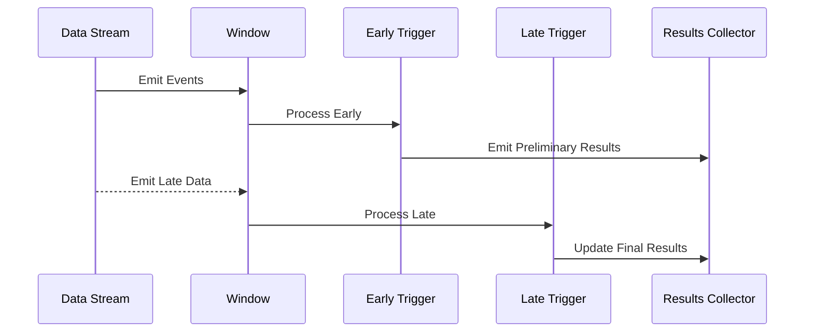

In complex event processing and stream processing scenarios, ensuring timely insights while accommodating late-arriving data is crucial. The **Early and Late Triggers** pattern allows you to emit interim results from a window before it fully closes through early triggers and then update these results upon the arrival of late data using late triggers. By adopting this pattern, you can enhance responsiveness and improve the accuracy of the results over time.

## Concepts and Terminology

- **Windowing**: In stream processing, data is grouped into finite sets called windows. These windows can be based on time (e.g., every 5 minutes) or data events (e.g., every 1000 events).
- **Early Triggers**: Enable the emitting of partial results as data arrives within a window, providing near-real-time analytics and estimates.
- **Late Triggers**: Systematically update results when data that should have arrived during a window is delayed and received later.

## Example Use Case

Consider a retail system tasked with processing sales transactions in real-time. The goal is to generate preliminary sales reports every minute for a 5-minute window to facilitate quick decision-making and to update these reports when the full window closes or when tardy sales data arrives.

## Architectural Approach

1. **Window Definition**: Define time-based windows, such as sliding or tumbling windows, to periodically aggregate incoming events.
2. **Trigger Configuration**: Configure early triggers to emit interim results before the window completes. Common configurations include emitting after a specific count or period.
3. **Handling Late Data**: Implement late triggers to adjust the final results based on late-arriving data. Define a lateness threshold to determine how long your system should expect and handle late data.
4. **Data Retention and Update Strategy**: Maintain stateful structures to update results when late data arrives and ensure accuracy.

## Example Code

Using Apache Beam, a popular stream processing framework, you can configure early and late triggers as follows:

```java
PCollection<KV<String, Integer>> salesData = ...; // Your input stream

PCollection<KV<String, Integer>> processedSales = salesData
    .apply(Window.<KV<String, Integer>>into(FixedWindows.of(Duration.standardMinutes(5)))
        .triggering(
            AfterWatermark.pastEndOfWindow()
                .withEarlyFirings(AfterProcessingTime.pastFirstElementInPane()
                    .plusDelayOf(Duration.standardMinutes(1)))
                .withLateFirings(AfterPane.elementCountAtLeast(1)))
        .withAllowedLateness(Duration.standardMinutes(10))
        .discardingFiredPanes())
    .apply(Sum.integersPerKey());
```

## Diagrams

Below is a sequence diagram that illustrates the flow of events through the early and late trigger process:



## Related Patterns

- **Session Windows**: Unlike time-driven windows, session windows are triggered by a period of inactivity between events, adapting to real-time interactions.
- **Watermarks**: Manage and estimate the progress of event time within stream processing systems, aiding late data handling.

## Additional Resources

- [Apache Beam Documentation on Triggers](https://beam.apache.org/documentation/programming-guide/#triggers)
- [Real-Time Stream Processing Systems](https://research.google/pubs/pub43864/)

## Summary

The Early and Late Triggers pattern empowers organizations to capture insights from data streams efficiently, balancing the trade-off between timeliness and accuracy. By employing early triggers, decision-makers receive up-to-date insights promptly, while late triggers ensure eventual accuracy by incorporating delayed data. Using frameworks like Apache Beam, implementing these triggers can dramatically improve your stream processing architecture, catering to both real-time and delayed event handling.
