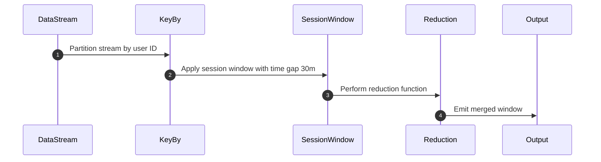

## Introduction

Window Merging is a stream processing design pattern used to combine adjacent windows based on event attributes or time gaps. This pattern is particularly useful in scenarios involving session windowing, where merging is necessary if user activity resumes within a pre-defined timeout period.

## Use Cases

- **Session Analytics**: Determine active user sessions by merging windows when users return within a short period.
- **Intrusion Detection**: Aggregate related security events over time intervals to detect threats.
- **Order Processing**: Consolidate consecutive orders from the same user placed in quick succession.

## Architectural Approach

### Components

- **Event Stream**: The continuous flow of events from various sources.
- **Window Manager**: Responsible for defining and managing the rules for window merging.
- **Merger**: The mechanism that combines two or more windows based on criteria such as time gaps or event attributes.

### Workflow

1. **Ingestion**: Events are continuously ingested from sources.
2. **Window Definition**: Define windows based on attributes, such as timestamp or event type.
3. **Condition Evaluation**: Establish conditions for which adjacent windows should be merged.
4. **Merging**: Trigger merging process if current window satisfies condition to merge with adjacent window.
5. **Output Emission**: Emission of merged windows for further processing or analysis.

## Example Code

Here's a basic example using Apache Flink for session windowing with window merging based on time gaps:

```java
DataStream<Event> events = ...; // Source of events

events
  .keyBy(Event::getUserId)
  .window(EventTimeSessionWindows.withGap(Time.minutes(30)))
  .reduce(new ReduceFunction<Event>() {
    @Override
    public Event reduce(Event e1, Event e2) {
      return mergeEvents(e1, e2);
    }
  });
```

### Explanation

- **Key By `UserId`**: Partition events based on user ID.
- **Session Windows**: Define a session window with a gap of 30 minutes.
- **Reduce Function**: Merge events when inside the same session window.

## Diagrams

### UML Sequence Diagram

Here's a visualization as a Mermaid UML Sequence Diagram:



## Related Patterns

- **Time-Based Window**: Fixed or sliding windowing based on time intervals.
- **Count-Based Window**: Windowing events based on count rather than time.
- **Watermarking**: Handling late data in stream processing.

## Additional Resources

- [Apache Flink Session Windows](https://nightlies.apache.org/flink/flink-docs-release-1.13/docs/dev/datastream/operators/windows/#session-windows)
- [Kafka Streams Session Windows](https://kafka.apache.org/23/documentation/streams/developer-guide/dsl-api.html#session-windows)

## Summary

Window Merging as a pattern bridges the temporal gaps between events, making it invaluable in stream processing applications requiring nuanced data aggregation, a fundamental design consideration in modern cloud-native architectures that demand real-time data insights.

By understanding and implementing window merging effectively, you can ensure that applications accurately reflect real-world interactions and processes, leading to better analytical outcomes and user experiences.
