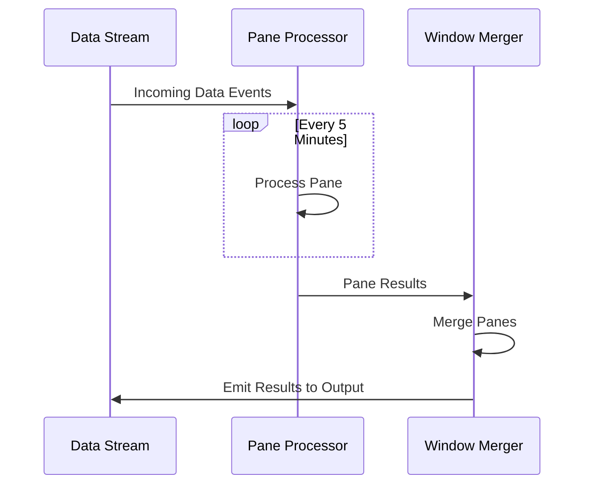

## Overview

The Pane Windows design pattern is an essential technique within the stream processing domain, designed to divide larger time windows into smaller, manageable panes. This practice facilitates incremental data processing, which is crucial for improving both the efficiency and scalability of real-time data applications.

## Problem Statement

In stream processing, handling vast amounts of continuous data poses a significant challenge. Using large, monolithic time windows for aggregations can lead to inefficiencies including substantial latency and considerable resource consumption. Hence, there's a need for a more granular approach to window management that optimizes processing without compromising on throughput or latency.

## Solution

The Pane Windows pattern divides a larger window into smaller fixed-size panes. Each pane represents a subdivision of the data stream, allowing for partial aggregations to be performed as data arrives. This approach reduces latency by facilitating faster, more frequent updates to aggregated results.

For example, if you're processing sensor data in a 1-hour window, applying the Pane Windows pattern could involve splitting that window into 5-minute panes. Each pane allows partial results to be computed, which can be later combined for the full 1-hour aggregation.

## Architectural Approach

Here's a step-by-step architectural approach to implementing the Pane Windows pattern within a stream processing application:

1. **Determine Window Size**: Decide on the size of the logical window (e.g., 1 hour).
2. **Divide into Panes**: Split this window into smaller panes (e.g., every 5 minutes). These panes are consistently sized to maintain uniform partial processing.
3. **Process Data Incrementally**: As data arrives, apply computations such as counts, sums, or averages within these panes.
4. **Merge Panes**: After processing all panes within a window, merge intermediate results to get the final aggregated output.
5. **Output Results**: Deploy the final results at the end of the window.

### Example Code

Here's an example using Apache Flink's stream processing to illustrate the Pane Windows pattern:

```java
DataStream<Event> events = ...; // Source of streaming events

WindowedStream<Event, String, TimeWindow> windowedStream = events
    .keyBy(event -> event.getKey())
    .window(TumblingEventTimeWindows.of(Time.hours(1)))
    .trigger(PurgingTrigger.of(CountTrigger.of(12))) // 5-minute(approximated) panes given a window size
    .evictor(TimeEvictor.of(Time.minutes(5)))
    .reduce((event1, event2) -> new Event(event1.getKey(), event1.getValue() + event2.getValue()));
```

### Diagram

Here's a simplified diagram using a Mermaid UML Sequence diagram to illustrate the flow of data within Pane Windows:



## Related Patterns

- **Tumbling Windows**: Fixed-size windows that don't overlap, useful for non-overlapping aggregations.
- **Sliding Windows**: Overlay windows with incremental shifts, ideal for overlapping data analysis.
- **Session Windows**: Windows defined by session gaps, good for user activity tracking.

## Additional Resources

- [Stream Processing with Apache Flink](https://flink.apache.org)
- [Real-Time Stream Processing in the Cloud](https://aws.amazon.com/streaming-data/)
- [Stream Processing Patterns & Best Practices](https://martinfowler.com/articles/patterns-of-streaming.html)

## Summary

The Pane Windows design pattern offers a refined approach to processing large data windows by dividing them into smaller panes. This subdivision allows for concurrent partial processing, resulting in reduced latency, improved resource management, and greater scalability. By understanding and applying the Pane Windows pattern, developers can build more efficient real-time data processing applications that effectively handle large-scale data streams.
