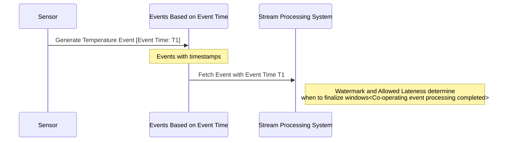

## Event-Time Windows

### Description

Event-Time Windows are a stream processing pattern where data is grouped based on the timestamp when events were generated (event time), not when they were processed by the system (processing time). This approach is essential in scenarios where data can arrive at a processing system out of order or with delays—issues frequently encountered in distributed systems.

When using event-time semantics, windows are based on the set of timestamps carried by the events themselves. This allows the handling of late-arriving data while ensuring accurate and temporal event processing. For instance, in IoT systems, sensor reads must be analyzed in the context of when they were actually recorded rather than when the data finally reaches the processing system.

### Architectural Approach

- **Ingestion Time vs. Event Time**: It's crucial to distinguish between the time events are ingested into the processing system and the actual event time. Event-Time Windows utilize the latter for windowing calculations.
- **Watermarks**: These are markers that indicate progress in processing event time. They effectively inform the system that no more data with timestamps earlier than the watermark's own timestamp should be expected.
- **Allowed Lateness**: This attribute defines the additional waiting period after the watermark. Events arriving during this period can still be included in the window, accommodating late arrivals.

### Best Practices

1. **Watermark Strategy**: Configure watermarks based on your knowledge of event delivery behavior. Some systems allow dynamic watermark adjustment depending on detected lateness patterns.

2. **Latency vs. Completeness Trade-Off**: Decide the balance between reducing latency (e.g., immediate results with possibly incomplete data) and completeness (e.g., more accurate results at the cost of latency due to increased waiting).

3. **Monitoring and Adjusting**: Use monitoring to observe the difference between event time and processing time. Adjust windowing parameters to keep this difference within acceptable limits.

4. **Handling Skewness**: Recognize events whose machine-generated event times are significantly skewed. Consider mechanisms to correct skewness if it impacts critical processing logic.

### Example Code

The following example shows how you might configure event-time windows using Apache Flink.

```java
DataStream<SensorReading> sensorDataStream = ...;

SingleOutputStreamOperator<Double> avgTemperature = sensorDataStream
    .assignTimestampsAndWatermarks(
        WatermarkStrategy.<SensorReading>forBoundedOutOfOrderness(Duration.ofSeconds(20))
        .withTimestampAssigner((event, timestamp) -> event.getTimestamp())
    )
    .keyBy(SensorReading::getSensorId)
    .window(TumblingEventTimeWindows.of(Time.minutes(5)))
    .allowedLateness(Time.minutes(1))
    .aggregate(new AverageTemperatureAggregateFunction());
```

### Diagrams

#### Event-Time Windows Diagram



### Related Patterns

- **Tumbling Windows**: Non-overlapping windows that group events at fixed uniform intervals using event time.
- **Sliding Windows**: Overlapping windows that slide forward and cover parts of the same event time frames for fine-grained analysis.
- **Session Windows**: Dynamic windows that group events related to a single session, adapting to idle periods between data arrivals.

### Additional Resources

- "The Dataflow Model: A Practical Approach to Balancing Correctness, Latency, and Cost in Massive-Scale, Unbounded, Out-of-Order Processing" by Google
- Apache Flink Documentation: Event Time and Watermarks
- Google Cloud Dataflow Documentation: Understanding Time Series

### Summary

Event-Time Windows in stream processing ensure that data is analyzed within the correct temporal context, despite challenges like latency and out-of-order arrival common in distributed systems. Implementing event-time semantics—along with appropriate watermarking and late event handling strategies—is pivotal for maintaining accurate and meaningful insights in real-time analytics frameworks. Embracing these techniques results in more reliable stream processing pipelines, crucial for scenarios ranging from IoT environments to real-time dashboards and beyond.
