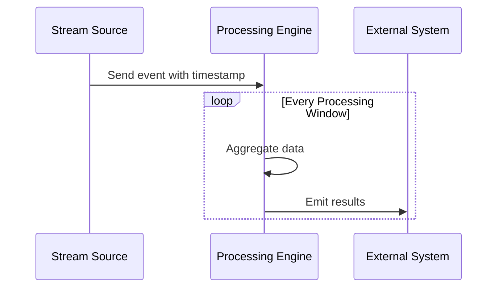

## Introduction

In stream processing, windows play a crucial role in dividing event streams into manageable sets for computation. The **Processing-Time Windows** pattern focuses on organizing data based on the time it is processed by the system rather than when the events occur. This is particularly useful in scenarios where processing order flexibility can be traded off against timing precision due to the nature of stream data or latency requirements.

## Description

Processing-time windows rely solely on the system clock to group incoming events. They process events in fixed or sliding windows based on when the event reaches the system, regardless of discrepancies between the event's actual occurrence time and its processing time. This makes processing-time windows ideal for use cases with less stringent time-ordering requirements or where the system clock is used as a reliable reference point. 

## Applicability

Processing-time windows are appropriate in the following scenarios:
- **Log Analysis**: When logs are to be aggregated based on their arrival time rather than their timestamp, which may vary due to network latency.
- **Monitoring and Alerting**: When alerts need to be generated based on current system activity rather than historical accuracy.
- **Batch Processing**: When streaming data can tolerate certain delays, and near real-time processing is sufficient.

## Architectural Approaches

- **Fixed Windows**: Define a set duration for processing-time windows (e.g., every 5 minutes), which triggers processing for any events arriving within this window.
- **Sliding Windows**: Continuously analyze event streams with overlapping windows, ideal for applications needing to maintain a context over several processing windows.
- **Session Windows**: Group events without a fixed duration, instead closing a window after a defined period of inactivity.

## Example Code

Here is an example of implementing processing-time windows using Apache Flink in Java:

```java
DataStream<Event> stream = ...;

DataStream<AggregateResult> aggregated = stream
    .keyBy(event -> event.getKey())
    .window(TumblingProcessingTimeWindows.of(Time.minutes(5)))
    .reduce(new ReduceFunction<Event>() {
        @Override
        public Event reduce(Event value1, Event value2) {
            // Define reduction logic
            return combinedEvent;
        }
    });
```

## Diagrams



## Related Patterns

- **Event-Time Windows**: Windows that rely on the actual event timestamp to organize events, critical for time-sensitive processing where order matters.
- **Ingestion-Time Windows**: Uses a similar approach by considering the time when an event enters the processing system pipeline.
- **Session Windows**: Define dynamic windows based on event activity, useful in session-based analysis like user activity tracking.

## Additional Resources

- Martin Kleppmann's "Designing Data-Intensive Applications"
- Apache Flink Documentation: Handling Time Windows
- Confluent's Kafka Streams documentation on windowing concepts

## Summary

Processing-time windows provide a straightforward methodology for stream processing when the sequencing of events based on their system arrival time suffices. This pattern excels under circumstances of flexible time precision and when minimal latency or processing ease is required over exact temporal accuracy. Suitable for real-time data monitoring and simpler analytics tasks, processing-time windows are a versatile addition to any stream processing toolkit.
