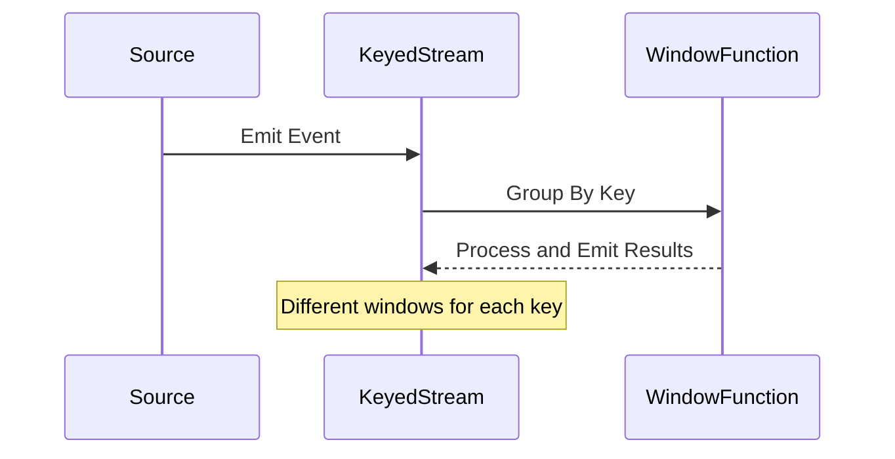

## Introduction

The Per-Key Windows pattern involves creating data stream windows specific to each key or group, which facilitates the application of individualized windowing strategies. This approach allows system architects to design solutions that accommodate varying logical time frames for different subsets of data. It is particularly useful for applications that need to perform analytics or computations on streams of data grouped by keys.

## Design and Architectural Approach

In real-time stream processing, leveraging windowing as a means to batch data into manageable subsets for analysis is crucial. The Per-Key Windows pattern enhances this by focusing on stream divisions based on unique keys. Each key can have its own windowing logic, dictated by business rules or user behavior.

* **Key-Extraction**: The initial phase involves identifying and extracting keys from your data stream, which could range from user IDs to product categories.
  
* **Window Policy Configuration**: Unlike a one-size-fits-all solution, these windows can be individually tailored. For instance, a more active user's data could be processed in shorter windows than less frequent users.

* **Data Collection and Storage**: For each window pertaining to a specific key, data is collected until the time expires, or a certain condition is met.

* **Execution**: Once a window closes, computations or aggregations meant for that dataset are executed, whether it be summing volumes, averaging sensor readings, or something more complex.

## Best Practices

- **Dynamic Windowing Adjustments**: Incorporate mechanisms to adjust window sizes dynamically based on current data stream patterns or workload demands.
  
- **State Management**: Effective state management ensures that as windows open and close, the necessary states are maintained consistently across different windows and retractions for false emissions are rectified.

- **Fault Tolerant Design**: Implement checkpoints or data retention strategies to ensure recovery in cases of failure.

## Example Code

Here’s an example illustrating the Per-Key Windows pattern using Apache Flink, a popular tool for distributed stream processing.

```java
StreamExecutionEnvironment env = StreamExecutionEnvironment.getExecutionEnvironment();

DataStream<MyEvent> stream = env.addSource(new MyEventSource());

MyKeyedStream<MyEvent, String> keyedStream = stream.keyBy(event -> event.getUserId());

DataStream<WindowResult> result = keyedStream
    .window(EventTimeSessionWindows.withGap(Time.minutes(15)))
    .apply(new MyPerKeyWindowFunction());

result.print();

env.execute("Per-Key Windows Example");
```

## Diagram



## Related Patterns

- **Sliding Windows**: Unlike sliding windows which provide overlapping time windows across the whole stream, per-key windows offer distinct windows per key.
- **Tumbling Windows**: Provide rigid non-overlapping windows, but without specific implementation for separate keys.

## Additional Resources

- [Apache Flink - KeyedStreams](https://nightlies.apache.org/flink/flink-docs-master/docs/dev/datastream/state/)
- [Stream Processing with Flink](https://www.oreilly.com/library/view/stream-processing-with/9781491974305/)

## Summary

The Per-Key Windows pattern is essential for use cases requiring segregated processing strategies on a per-key basis. It empowers systems to respect the heterogeneity of real-time data, improving processing efficiency and ensuring appropriate conduct of operations across variable datasets. It provides flexibility in time-bound operations, enhancing the contextual relevance of data processing applications in stream processing environments.
