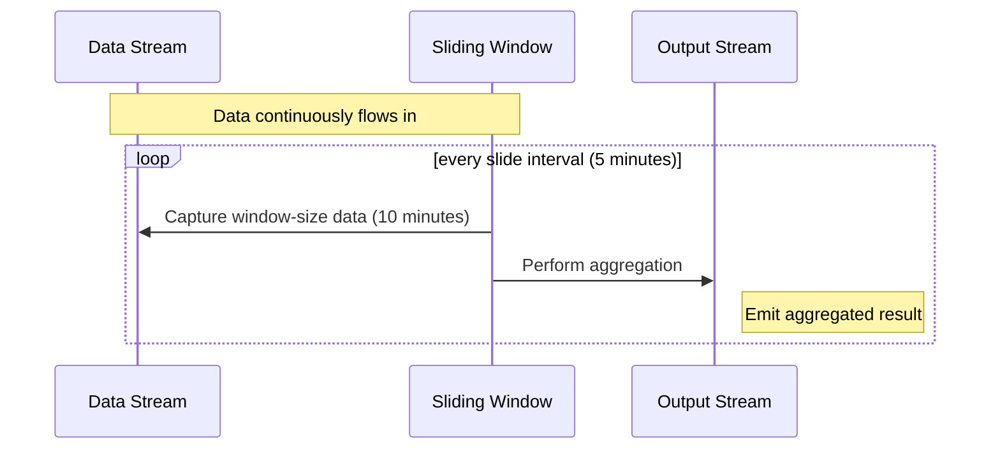

---

linkTitle: "Sliding Windows"
title: "Sliding Windows: A Stream Processing Design Pattern"
category: "Windowing Patterns"
series: "Stream Processing Design Patterns"
description: "Explore Sliding Windows, a stream processing design pattern for handling real-time data by applying overlapping time windows of a specified size and slide interval. Learn how these windows compute aggregates like averages or counts continuously."
categories:
- Stream Processing
- Real-time Analytics
- Data Aggregation
tags:
- Sliding Windows
- Stream Processing
- Real-time Data
- Data Aggregation
- Overlapping Windows
date: 2024-07-07
type: docs

canonical: "https://softwarepatternslexicon.com/101/4/2"
license: "© 2024 Tokenizer Inc. CC BY-NC-SA 4.0"
---

## Sliding Windows

### Introduction

Sliding Windows is a common pattern in stream processing, suitable for applications that require continuous computation from data streams, often in real-time. The pattern involves applying a window to your data stream that "slides" over time, enabling overlapping windows for computation. This makes it ideal for situations where you need to keep track of aggregates such as sums, averages, or counts that update frequently.

### Key Concepts

- **Window Size**: The length of time data is grouped together. For instance, a window size of 10 minutes means the system computes aggregates over a 10-minute span.
  
- **Slide Interval**: The time period by which the window advances. A slide interval of 5 minutes in conjunction with a 10-minute window size means that every 5 minutes, a new computation incorporates new elements entering the window while excluding old ones.

- **Overlap**: As the slide interval is smaller than the window size, windows may overlap, causing some data to be part of multiple windows.

### Example Use Case

Consider an IoT application that measures the average temperature from a set of sensors. You need to compute the average temperature over the last 10 minutes, updated every 5 minutes.

### Implementation

Here’s a simplified example using Apache Flink with Scala:

```scala
import org.apache.flink.streaming.api.scala._
import org.apache.flink.streaming.api.windowing.time.Time

case class SensorData(id: String, temperature: Double, timestamp: Long)

object SlidingWindowExample {

  def main(args: Array[String]): Unit = {
    val env: StreamExecutionEnvironment = StreamExecutionEnvironment.getExecutionEnvironment

    // Sample data stream (in practice, this would be read from a source such as Kafka)
    val sensorData: DataStream[SensorData] = // ...

    // Define and apply the sliding window operation
    val averageTemperature = sensorData
      .keyBy(_.id)
      .timeWindow(Time.minutes(10), Time.minutes(5))
      .reduce((a, b) => SensorData(a.id, (a.temperature + b.temperature) / 2, b.timestamp))

    averageTemperature.print()

    env.execute("Sliding Windows Example")
  }
}

```

### Diagram

Let's illustrate the sliding window concept with a simple sequence diagram using Mermaid:



### Related Patterns

- **Tumbling Windows**: Non-overlapping windows that aggregate events over fixed periods. Suitable for batch-like processing at fixed intervals.
  
- **Session Windows**: Windows based on events separated by inactivity gaps, useful for modeling user sessions.

### Best Practices

1. **Optimal Buffer Management**: To handle high-throughput streams, ensure you allocate sufficient memory and use efficient buffering strategies to manage overlapping data.

2. **Latency vs. Cost**: Tune slide intervals and window sizes based on your application's required latency and cost targets.

3. **Handling Late Events**: Implement strategies (e.g., watermarks, allowed lateness) to correctly handle or emit late data in sliding windows.

### Additional Resources

- [Apache Flink: Windowing Functions](https://flink.apache.org/news/2015/12/04/A-guide-to-windowing-in-apache-flink.html)
- [Windowing with Kafka Streams](https://kafka.apache.org/20/documentation/streams/core-concepts)

### Summary

The Sliding Windows pattern is invaluable in real-time analytics and stream processing, allowing for continuous aggregate computations over time-varying data. By carefully choosing your window size and slide interval, you can efficiently process and analyze data streams to derive meaningful insights.


