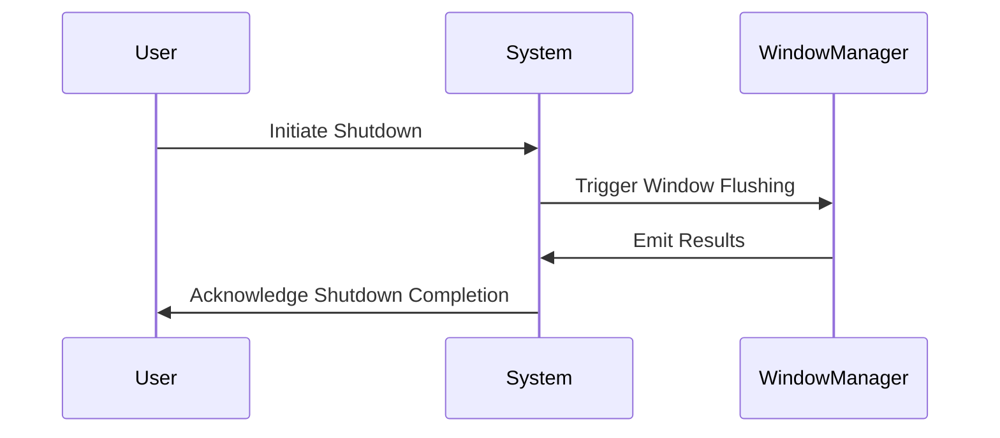

## Overview

The Window Flushing pattern is integral in stream processing applications, facilitating the cleanup and dissemination of processing results under constrained circumstances such as system shutdowns or resource adjustments. This pattern ensures consistency, prevents data loss, and avoids resource saturation by compelling windows to release their accumulated data.

## Design Pattern Intent

The intent behind Window Flushing is to maintain throughput stability and data integrity by guaranteeing that all active windows in a streaming data application transmit their contents and reset when pre-defined triggers or conditions occur. Implementations of window flushing are crucial during operations like scaling, to prevent stranded or unmanaged data states which can lead to processing inconsistencies or application downtime.

## Applicability

- **System Shutdowns**: Employed when an encoded strategy for orderly shutdown is required, ensuring minimal data loss and consistent states.
- **Scaling Operations**: Utilized when applications need to scale up or down, smoothly transitioning without losing any data or context.
- **Resource Constraints**: Implemented to manage limited computational or storage resources, allowing the system to free up space and avoid crashes or slowdowns.

## Implementation Strategy

In implementing the Window Flushing pattern, consider the following approaches and best practices:

1. **Trigger-Based Flushing**: Define triggers such as time-based, event-count based, or external signals to initiate flushing.
2. **Transactional State Management**: Maintain transaction logs to ensure flushed windows are consistent with processing guarantees like exactly-once processing.
3. **Graceful Shutdown Protocols**: Use built-in frameworks' handling mechanisms to trigger window flushing during shutdowns, enabling smooth resource release.
4. **Monitoring and Alerts**: Establish monitoring to identify and respond to conditions necessitating window flushing, such as memory thresholds or anomaly detection.

### Example Code Snippet

```java
import org.apache.flink.streaming.api.environment.StreamExecutionEnvironment;
import org.apache.flink.streaming.api.functions.windowing.WindowFunction;
import org.apache.flink.streaming.api.windowing.assigners.TumblingEventTimeWindows;
import org.apache.flink.streaming.api.windowing.time.Time;
import org.apache.flink.util.Collector;

public class WindowFlushingExample {

    public static void main(String[] args) {
        StreamExecutionEnvironment env = StreamExecutionEnvironment.getExecutionEnvironment();

        env.socketTextStream("localhost", 9999)
            .keyBy(value -> value.split(",")[0])
            .window(TumblingEventTimeWindows.of(Time.minutes(1)))
            .apply(new WindowFunction<String, String, String, TimeWindow>() {
                @Override
                public void apply(String key, TimeWindow window, Iterable<String> input, Collector<String> out) {
                    // Process input and output results for each window
                    for (String value : input) {
                        out.collect("Window Result: " + value);
                    }
                }
            });

        // Simulate a flushing condition
        env.execute("Window Flushing Example");
    }
}
```

## Diagrams



## Related Patterns

- **Punctuated Windowing**: Similar to window flushing, this pattern uses punctuations in streams to determine when operations should end.
- **Checkpointing**: Ensures that the window state can be externally stored and restored, complementing flush operations to maintain data integrity.
- **Event Time Processing**: Helps in coordinating window functions with real-world time events, often used alongside these triggers.

## Additional Resources

- [Apache Flink Documentation](https://flink.apache.org/flink-docs-stable/)
- [Stream Processing with Apache Kafka](https://kafka.apache.org/documentation/streams/)

## Summary

The Window Flushing pattern is essential in designing robust stream processing systems, effectively managing the emission and clearing of stateful window data under certain operational changes. Its implementation can significantly ensure data integrity, resource management, scalability, and reliability of cloud computing solutions that rely heavily on real-time data processing.
