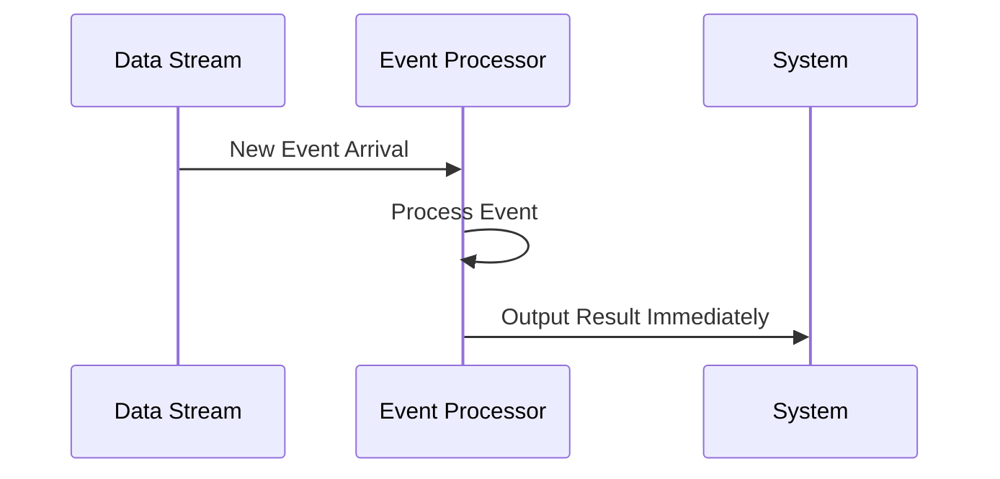

## Introduction

Continuous Windows are a pattern in stream processing where the system continuously processes streams of data on a per-event basis without using fixed boundaries. This approach is particularly useful for applications requiring real-time analysis, such as updating dashboards with each incoming data event.

## Detailed Explanation

Continuous Windows serve an essential role in real-time stream processing systems by evaluating each data event as it arrives and generating output right away. This mechanism contrasts sharply with other windowing strategies that batch events until some condition like time or count is met before processing.

### Characteristics

- **Event-Driven Processing**: Every single event leads to computation, producing results continuously.
- **Immediate Feedback**: Suitable for systems requiring instant updates, like monitoring systems.
- **No Fixed Boundaries**: Unlike other windowing strategies (tumbling, sliding), Continuous Windows do not accumulate events over a predefined duration or count.

### Use Cases

1. **Real-Time Dashboards**: Updating metrics and visual data on financial dashboards as each stock trade data point streams in.
2. **Fraud Detection**: Analyzing financial transactions in real-time to flag anomalies.
3. **IoT Data Streams**: Immediate processing of sensor data for real-time alert generation.

## Example Code

Below is a conceptual example using Apache Flink in Java:

```java
public class ContinuousWindowExample {
    public static void main(String[] args) throws Exception {
        StreamExecutionEnvironment env = StreamExecutionEnvironment.getExecutionEnvironment();

        DataStream<String> dataStream = env.socketTextStream("localhost", 9090);

        // Process each event as it comes in
        dataStream.map(event -> {
            // Perform transformation or aggregation here
            return processEvent(event);
        }).print();

        env.execute("Continuous Window Example");
    }

    private static String processEvent(String event) {
        // Raw processing logic for each incoming event
        return "Processed: " + event;
    }
}
```

## Diagrams

### UML Sequence Diagram



## Related Patterns

- **Tumbling Windows**: Divide streams into non-overlapping fixed chunks for batch processing.
- **Sliding Windows**: Overlapping windows for processing streams with a sliding time or count window.
- **Session Windows**: Group events within a session, measuring inactivity to form boundaries.

## Additional Resources

- [Apache Flink's Event Time and Processing Time Windows](https://nightlies.apache.org/flink/flink-docs-release-1.13/docs/dev/datastream/operators/windows/#window-assigners)
- [Real-time Streaming Reference Architecture](https://www.oreilly.com/library/view/big-data-architectures/9781492063445/)

## Summary

Continuous Windows present an efficient strategy for real-time processing by providing immediate feedback with no delay associated with batch processing inside fixed boundaries. They are incredibly beneficial for applications requiring instant data insights and timely reactions, thus playing a crucial role in systems like stream analytics, IoT, and financial transaction monitoring. 

By using this pattern, architectures leveraging stream processing frameworks such as Apache Flink or Apache Kafka Streams can gain substantial real-time data handling capabilities requisite for high-performance data-driven applications.

