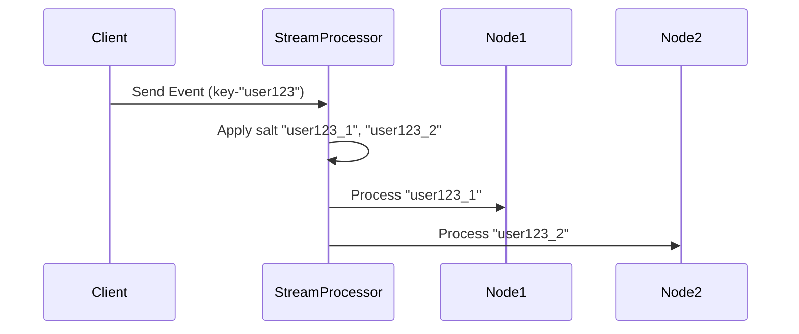

Data skew handling in windows is a critical aspect of stream processing systems, particularly when dealing with high-throughput data flows. In many real-time analytics scenarios, the distribution of data can be uneven across different windows, leading to processing hotspots and imbalance across nodes in a distributed system. This pattern addresses the challenge of managing uneven data distribution to ensure efficient load balancing and optimal resource utilization.

## Problem

When processing stream data using windowing techniques, data skew occurs when certain keys or data segments receive a disproportionately large volume of events compared to others. This uneven distribution can lead to certain nodes being overwhelmed while others remain underutilized, thus creating bottlenecks and reducing the overall throughput of the system.

## Solution

The solution involves detecting data skew and applying strategies to mitigate its impact on processing systems. Key methods include:

1. **Salting**: Append different salt values to skewed keys to distribute load more evenly. For instance, if a key "user123" is causing skew, create multiple virtual keys like "user123_1", "user123_2" to distribute its load.
   
2. **Load-aware Partitioning**: Dynamically adjust the partitioning logic based on load metrics to ensure an even distribution of data. This can involve using partitioners that consider the current load on each node before assigning new data.
   
3. **Load Balancing Strategies**: Use consistent hashing with additional nodes to redistribute the load of the skewed data. By adjusting the number of partitions or adding new nodes dynamically, the load can be better balanced.

4. **Adaptive Windowing**: Modify window sizes or apply different windowing strategies for different data segments based on their observed load characteristics.

5. **Reservoir Sampling**: Use sampling techniques to reduce the volume of processed skewed data temporarily, thus mitigating the management overhead during peak loads.

## Example Code

Here's a simple example using a stream processing framework like Apache Flink to handle data skew:

```scala
val skewedStream = inputStream
  .keyBy(event => hash(event.key) % numPartitions)
  .process(new SkewHandlingFunction())

class SkewHandlingFunction() extends KeyedProcessFunction[Int, Event, Output] {
  override def processElement(event: Event, ctx: Context, out: Collector[Output]): Unit = {
    val saltedKey = event.key + "_" + ctx.getCurrentKey
    ctx.timerService().registerEventTimeTimer(determineTimeWindow(saltedKey))
    out.collect(processEventWithSalt(saltedKey, event))
  }

  def determineTimeWindow(saltedKey: String): Long = {
    // Implement logic for determining the next window based on salted key
  }
  
  def processEventWithSalt(saltedKey: String, event: Event): Output = {
    // Implement the processing logic using the salted key to balance load
  }
}
```

## Diagrams

### Load Balancing with Salting



## Related Patterns

- **Load Shedding**: A strategy to temporarily drop data when overwhelmed.
- **Shuffling**: Redistributing data across partitions to achieve a balanced load.
- **Dynamic Partitioning**: Adjusting partitions based on current conditions in the stream flow.

## Additional Resources

- [Implementing Dynamic Load Balancing in Stream Processing](https://example.com/dynamic-load-balancing)
- [Advanced Windowing Approaches in Apache Flink](https://example.com/advanced-windowing-flink)
- [Apache Kafka Load Balancing Techniques](https://example.com/kafka-load-balancing)

## Summary

Handling data skew in windows is crucial for maintaining the performance of stream processing systems. By employing strategies like salting, load-aware partitioning, and adaptive windowing, it is possible to maintain balanced workloads and ensure efficient resource utilization. Through these techniques, stream processing systems can better accommodate uneven data distributions, leading to improved scalability and resilience.
