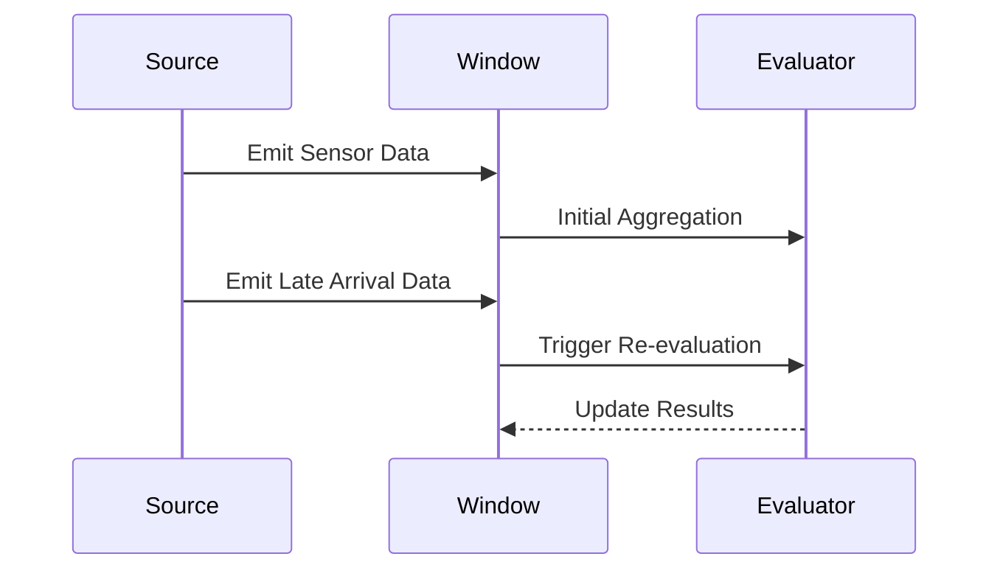

## Window Re-evaluation Pattern

### Description

The Window Re-evaluation pattern involves recomputing the results of a time or count-based window when new information affects prior outcomes, a scenario typically resulting from late-arriving events. This pattern is integral to ensuring data accuracy in stream processing systems where data timeliness is variable and dynamic changes matter significantly for computation precision.

### Use Cases

1. **Real-time Analytics**: Adjusting insights as new data becomes available.
2. **Sensor Data Processing**: Updating computations such as averages, min/max, or outliers when delayed sensor readings are received.
3. **Financial Transactions**: Re-evaluating account balances or fraud detection mechanisms when historical transactions are logged later.

### Architectural Approaches

To implement the Window Re-evaluation pattern, use a stream processing framework that supports:

- **Watermarks**: Incorporate mechanisms to track event timeliness and allow the system to recognize when re-evaluation is necessary.
- **Stateful Processing**: Retain the state of previous computations within the windows that can be updated or rolled back when re-evaluation occurs.
- **Triggers**: Use events that can initiate re-evaluation processes whenever new information contradicts earlier assumptions or data.

### Example Code

Here's an example of how one might implement window re-evaluation using Apache Flink in Scala:

```scala
import org.apache.flink.streaming.api.scala._
import org.apache.flink.streaming.api.windowing.time.Time
import org.apache.flink.streaming.api.windowing.assigners.TumblingEventTimeWindows
import org.apache.flink.streaming.api.windowing.triggers.EventTimeTrigger

case class SensorData(id: String, temperature: Double, timestamp: Long)

val env = StreamExecutionEnvironment.getExecutionEnvironment

val sensorDataStream: DataStream[SensorData] = env.fromCollection(Seq(
  SensorData("sensor_1", 22.5, 1609459200000L),
  SensorData("sensor_1", 23.0, 1609462800000L),
  // Late arrival event
  SensorData("sensor_1", 21.0, 1609459200000L)
))

val averageTemperatureStream = sensorDataStream
  .assignAscendingTimestamps(_.timestamp)
  .keyBy(_.id)
  .window(TumblingEventTimeWindows.of(Time.hours(1)))
  .trigger(EventTimeTrigger.create())
  .aggregate(new AverageAggregateFunction)

averageTemperatureStream.print()

env.execute("Window Re-evaluation Example")
```

### Mermaid Diagram

Below is a simplified sequence diagram that illustrates the flow of data and the window re-evaluation process:



### Best Practices

- **Handling Watermarks Correctly**: Appropriately configure watermarks to accommodate the typical lateness of your data to reduce unnecessary computations while accounting for late arrivals.
- **Efficient State Management**: Keep state management efficient to quickly recompute results and avoid computational bottlenecks.
- **Backpressure and Bottleneck Management**: Monitor and manage backpressure scenarios since re-evaluation processes can put additional stress on the system.

### Related Patterns

- **Event Time Windows**: Different configurations for organizing event time-based computations that align with re-evaluation strategies.
- **Trigger-based Processing**: Another pattern focusing on specific events that prompt reactivity in data processing.

### Additional Resources

1. [Apache Flink Documentation on Windowing](https://nightlies.apache.org/flink/flink-docs-release-1.15/docs/dev/datastream/operators/windows/)
2. [Concepts of Stream Processing](https://kafka.apache.org/documentation/streams/)
3. [Google Cloud Dataflow - Watermarks Overview](https://cloud.google.com/dataflow/docs/concepts/model#watermarks)

### Summary

The Window Re-evaluation pattern is essential for maintaining consistency and accuracy in stream processing systems, particularly when dealing with out-of-order events. Implementations require careful consideration of event timings, state management, and processing triggers for optimal efficiency.

By leveraging this pattern, systems can dynamically adapt to changes in data, ensuring correct analysis and decisions are always based on the most current information possible.
