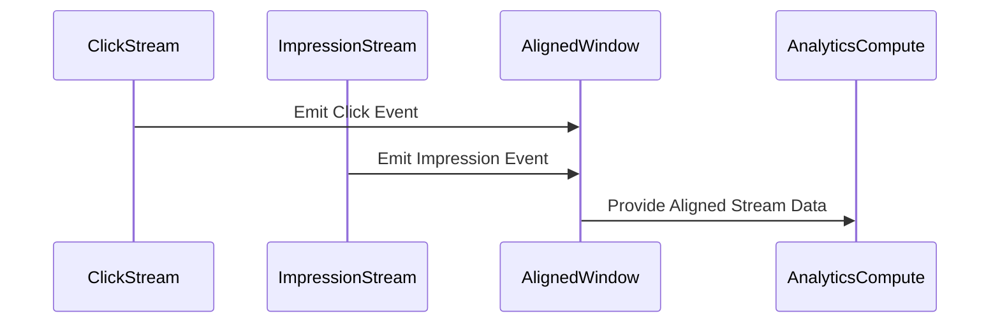

## Introduction

In the realm of real-time stream processing, data from different sources often arrives with varying temporal characteristics. To perform accurate and meaningful operations such as joins and aggregations, it's crucial to synchronize or align the windows of these streams. The Window Alignment pattern provides a structured approach to synchronizing temporal windows across disparate streams to ensure consistency and precision in data processing tasks.

## Problem

Data streams such as logs, user interactions, and impressions naturally originate from multiple independent sources. Their temporal windows might not coincide, creating challenges for operations that require temporal alignment, like joins and aggregates. A lack of synchronization can lead to mismatched data interactions and unreliable analytics.

## Solution

The Window Alignment pattern involves structuring the incoming data into windows where the boundaries are tightly controlled to ensure that corresponding or related data from multiple streams align in time. This pattern can be implemented by:

- **Defining Consistent Window Boundaries**: Establish fixed window intervals (such as every minute or every hour) across all streams that need to be aligned. This ensures events are compared or aggregated in the same temporal context.
- **Using Watermarks**: To handle late-arriving data, watermarks can be used as indicators of the progress of window completion, allowing for certain tolerances in data arrival before triggering computations.
- **Applying Time Synchronization Techniques**: Techniques like buffering, time scaling, or responsive adjustments to accommodate drift and variations in data arrival can be used.

## Best Practices

1. **Choose the Correct Windowing Strategy**: Depending on the data characteristics and use case, different windowing strategies (tumbling, sliding, session-based) should be considered.
2. **Estimate Event Time Skew**: Understand typical time differences between events in the aligned streams to adjust windows accordingly.
3. **Implement Error Handling for Late Data**: Use mechanisms to handle late or early data arrivals effectively to avoid skewed results.

## Example Code

Here is a simplified example using Apache Flink to align windows of two streams:

```scala
val clickStream: DataStream[ClickEvent] = ...
val impressionStream: DataStream[ImpressionEvent] = ...

val alignedClicks = clickStream
    .assignTimestampsAndWatermarks(...)
    .keyBy(_.adId)
    .window(TumblingEventTimeWindows.of(Time.minutes(1)))

val alignedImpressions = impressionStream
    .assignTimestampsAndWatermarks(...)
    .keyBy(_.adId)
    .window(TumblingEventTimeWindows.of(Time.minutes(1)))

val resultStream = alignedClicks.join(alignedImpressions)
    .where(_.adId)
    .equalTo(_.adId)
    .window(TumblingEventTimeWindows.of(Time.minutes(1)))
    .apply(new JoinFunction[ClickEvent, ImpressionEvent, ClickImpressionResult] {
      override def join(first: ClickEvent, second: ImpressionEvent): ClickImpressionResult = {
        ClickImpressionResult(first, second)
      }
    })
```

## Diagrams

### Sequence Diagram



## Related Patterns

- **Event Time Processing**: A broader approach to processing events based on their inherent timestamp rather than their arrival time.
- **Session Windows**: Useful when interactions occur sporadically and are naturally demarcated by periods of inactivity.

## Additional Resources

- [Understanding Stream Windowing](https://flink.apache.org/news/2021/02/25/stream-processing-patterns.html)
- [Complex Event Processing and Window Alignment](https://www.infoq.com/articles/event-processing-patterns/)
- [Real-Time Data Processing with Apache Kafka and Flink](https://kafka.apache.org/)

## Summary

The Window Alignment pattern is a critical strategy in stream processing to ensure consistent, accurate analytics and data handling across multiple real-time data streams. By synchronizing window boundaries and employing techniques like watermarks, one can achieve reliable data joins and aggregations, thereby improving data quality and decision-making processes in stream processing systems.
