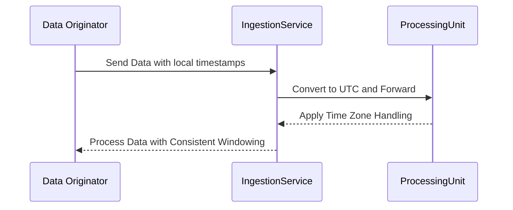

## Introduction

**Time Zone Handling** is a crucial pattern in stream processing systems that addresses the complexity of managing and accounting for time zone differences across global applications. With burgeoning global data flows, understanding and harmonizing time across different time zones is essential to ensure the correctness and relevance of window-based data analyses.

## Problem 

In stream processing, time-dependent operations rely heavily on windowing techniques, particularly when applying aggregation or transformation functions based on time intervals. In globally distributed applications, incoming data could originate from multiple time zones, resulting in discrepancies if not properly adjusted. Such discrepancies could adversely affect data analyses, deduplication processes, sessionization, and more. Consequently, discrepancies lead to inaccurate data insights and erode the reliability of systems.

## Solution

Time Zone Handling entails strategies and approaches that ensure consistent and accurate time window alignment across different time zones:

1. **Uniform Time Representation**: Convert all incoming timestamps to a standard time, often UTC, upon ingestion. This ensures uniformity across the processing pipeline. Example in Scala:

```scala
import java.time.{ZonedDateTime, ZoneId}

def convertToUTC(zonedDateTime: ZonedDateTime): ZonedDateTime = {
  zonedDateTime.withZoneSameInstant(ZoneId.of("UTC"))
}
```

2. **Localized Window Logic**: Adjust window definitions to consider time zone differences. For example, applying local time logic as contexts demand, especially for region-specific analyses.

3. **Data Annotation**: Enrich data with metadata about its originating time zone for detailed contextual analyses and reassembly in downstream processes.

4. **Flexibility in Configuration**: Provide mechanisms to dynamically query and adjust time zones based on conditions or specified business rules.

## Example Code

Here's a hypothetical example of defining a windowing function in JavaScript to accommodate different time zones dynamically:

```javascript
function defineWindow(startTime, duration, timeZone) {
  const startInUTC = new Date(startTime).toLocaleString("en-US", {timeZone: 'UTC'});
  const offset = new Date().getTimezoneOffset() * 60000;
  const localStartTime = new Date(new Date(startInUTC).getTime() - offset);
  
  return {
    windowStart: localStartTime,
    windowEnd: new Date(localStartTime.getTime() + duration)
  };
}
```

## Diagram



## Related Patterns

- **Priority Queueing**: Ensures timely processing of data by prioritizing age or time sensitivity.
- **Event Time Processing**: Focuses on processing events according to their occurrence time rather than ingestion time, often used in conjunction with time zone handling.
- **Session Windowing**: Useful for tracking user sessions accurately across time zones.

## Additional Resources

- [TimeZone API Documentation](https://developer.mozilla.org/en-US/docs/Web/JavaScript/Reference/Global_Objects/DateTimeFormat)
- **Books**: *Stream Processing with Apache Flink* by Fabian Hueske
- **Courses**: Coursera's *Stream Processing and Analytics*

## Summary

Incorporating effective **Time Zone Handling** mechanisms into stream processing systems is paramount for any application acting on a global scale or requiring precision-timed operations. By establishing a system that accommodates for and adjusts between varied time zones accurately, organizations ensure data's temporal correctness, ensuring consistent insights and data integrity.
