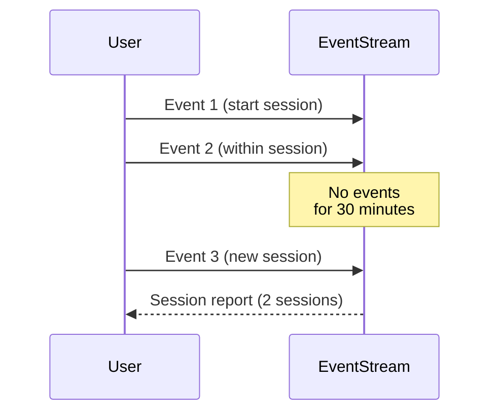

## Session Windows Design Pattern

### Introduction

In stream processing, session windows are used to group a series of events into sessions, thus allowing for flexible detection of periods of user activity and inactivity. Unlike fixed or sliding windows, session windows do not have a predetermined length, making them ideal for aggregating events like website interactions where the session length is not constant.

### Detailed Explanation

Session windows are constructed with two primary components:

- **Inactivity Gap**: The maximum permitted period between consecutive events before the session window is closed.
- **Event Trigger**: Occurs whenever a new event arrives after the inactivity gap ends, triggering the creation of a new session.

When implementing session-based event grouping, an essential side effect is the generation of new sessions each time a new event appears following the expiration of the specified inactivity gap.

### Example Use Case

Consider an online application mistakenly assumed to track user sessions based on a fixed time window. By switching to session windows:

- **User Interactions**: Let's say an online app groups user's browsing history.
- **Activity Analyzed**: If no activity occurs for 30 minutes, a session is considered ended. Events that occur within that thirty minute window are grouped into a session, such as viewed items, searches, and purchases.

### Best Practices

- **Dynamic Session Length**: Design your architecture to support sessions of varying length due to different levels of user interaction.
- **Optimize Gap Threshold**: Adjust inactivity thresholds carefully based on historical data and typical user behavior patterns.
- **Handling Late Arrivals**: Ensure that your stream processing engine can manage late arriving data effectively, potentially updating session data when needed.

### Example Code

Here is a simple example demonstrating how sessions can be implemented in Apache Flink:

```java
DataStream<Event> events = ...;

DataStream<SessionWindow> sessionized = events
    .keyBy(event -> event.getUserId())
    .window(EventTimeSessionWindows.withGap(Time.minutes(30)))
    .apply(new SessionWindowFunction());
```

In this code sample:
- **`EventTimeSessionWindows.withGap(Time.minutes(30))`** specifies the duration of inactivity that will close the session window.

### Diagrams

#### Session Window Sequence Diagram



### Related Patterns

- **Tumbling Windows**: Unlike session windows, tumbling windows have a fixed duration and do not overlap.
- **Sliding Windows**: Allows overlapping windows and processes event streams within overlapping windows of a fixed length.
- **Event Time Processing**: Utilizes event timestamps to ensure windows are calculated based on actual event occurrence times.

### Additional Resources

- [Apache Flink Documentation on Session Windows](https://flink.apache.org/docs)
- [Stream Processing with Apache Kafka](https://kafka.apache.org/documentation/streams)

### Summary

Session windows offer a powerful stream processing construct, enabling flexible groupings of events driven by user activity. By setting key parameters such as inactivity gaps, systems can effectively manage and analyze periods of unbounded events. This dynamic approach outperforms static windowing techniques and aligns closely with real-world user session patterns, making it invaluable in applications where understanding user behavior is critical.
