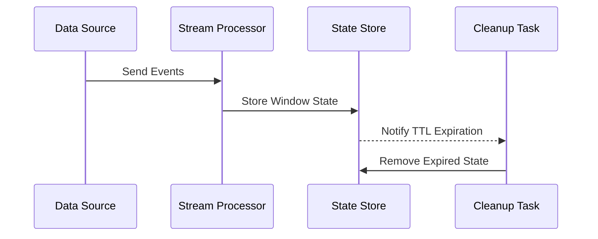

## Introduction

In stream processing systems, windowing is a technique used to group data streams based on time or count, providing snapshots over time intervals for analysis. As window elements expire, managing and cleaning up the window state becomes crucial. Without effective cleanup strategies, expired state can lead to memory leaks, degrade performance, and adversely impact system resources.

## Design Pattern Overview

The Window State Cleanup pattern addresses the need to efficiently manage and remove state associated with expired windows. This pattern is essential in stream processing environments where real-time data processing necessitates dynamic state management. By implementing a clear strategy to handle expired state data, you ensure optimized resource utilization and maintain system performance.

## Architectural Approaches

- **Time-to-Live (TTL)**: Set TTL for window state. Once the TTL expires, the state is automatically cleaned up. This approach is beneficial in scenarios where data has a predictable lifespan.
  
- **Trigger-Based Cleanup**: Implement triggers to clean up state when certain conditions are met. Triggers can be time-based, count-based, or context-specific (e.g., on reaching a watermark).

- **Asynchronous State Cleanup**: Schedule asynchronous cleanup jobs that periodically scan, evaluate, and remove expired window state. This offloads cleanup operations without impacting main processing flows.

## Example Code

In Apache Flink, you can use `TimeWindow` with a TTL configuration:

```java
StreamExecutionEnvironment env = StreamExecutionEnvironment.getExecutionEnvironment();

DataStream<MyEvent> events = env.fromSource(source);

events
    .keyBy(MyEvent::getKey)
    .window(TumblingProcessingTimeWindows.of(Time.seconds(10)))
    .evictor(TimeEvictor.of(Time.minutes(1)))
    .process(new MyWindowFunction())
    .uid("window-cleanup-example")
    .name("window-state-cleanup")
    .getExecutionEnvironment()
    .execute();
```

In this example, an evictor is used to remove state older than 1 minute, ensuring that expired window state is efficiently cleaned.

## Diagrams

### Mermaid Sequence Diagram: Window State Management



## Related Patterns

- **Event Time vs. Processing Time Windows**: The choice of event or processing time impacts window states and cleanup strategies.
  
- **Watermarking**: Watermarks help determine the progress of event time and trigger state cleanup in event-time-based systems.

## Best Practices

- **Monitoring and Alerting**: Implement monitoring to track state size and alert on unexpected growths indicating potential cleanup issues.

- **Load Testing**: Periodically conduct load testing to ensure state cleanup mechanisms are efficient under various loads.

- **State Backends**: Use appropriate state backends that support efficient persistence and retrieval, optimizing cleanup operations.

## Additional Resources

- [Apache Flink Documentation - State TTL Mechanics](https://nightlies.apache.org/flink/flink-docs-release-docs/dev/stream/state/state.html#state-time-to-live-ttl)
- [Kafka Streams - Windowed State Stores](https://kafka.apache.org/28/documentation/streams/developer-guide/windowed.html)
- [Stream Processing with Apache Flink](https://www.oreilly.com/library/view/stream-processing-with/9781491974285/)

## Summary

The Window State Cleanup pattern provides essential strategies for managing expired windows in stream processing. By employing techniques such as TTL, trigger-based cleanup, and asynchronous management, this pattern ensures efficient use of resources and consistent performance of stream processing systems. Choosing the right approach depends on specific application requirements, processing semantics, and expected workload characteristics.
