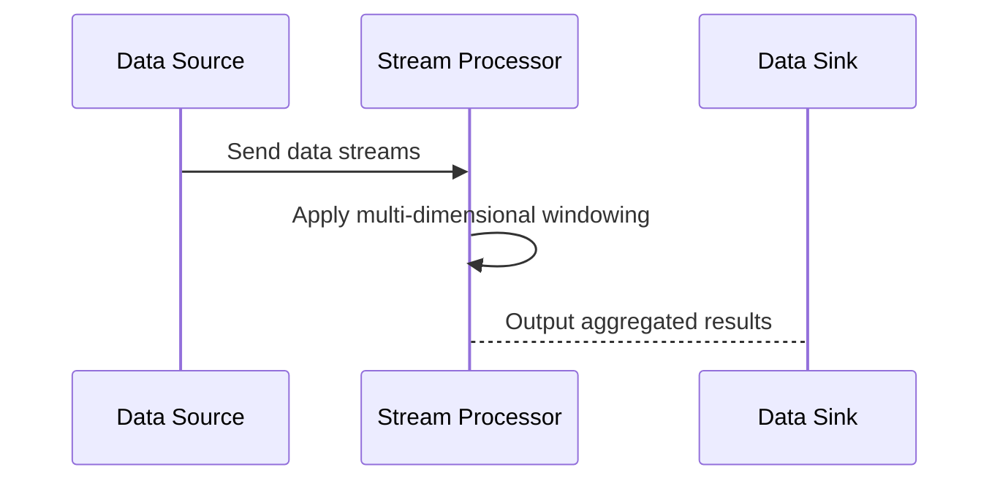

## Overview

Multi-Dimensional Windows are a powerful stream processing construct that enables the logical organization of data into overlapping or non-overlapping windows based on multiple dimensions. This pattern often employs time as one crucial dimension and extends the concept to include additional dimensions, such as spatial data, to facilitate richer analytical insights. By applying windows based on attributes like user-defined keys, geographical regions, or device identifiers, this approach suits various advanced data processing scenarios.

## Architectural Approach

In the architectural context, Multi-Dimensional Windows enable data streams to be monitored and queried in real-time across various slices of data dimensions. Here’s how it’s typically implemented:

- **Time Dimension**: Include time-based criteria (e.g., per minute, hour, day).
- **Spatial Dimension**: Consider geographical data such as regions, countries, or user locations.
- **Custom Tags**: Use tags like device type or user segment for further segmentation.

Employing tools like Apache Flink or Apache Kafka Streams can facilitate robust implementations. These tools can handle the windowing logic in stateful stream processing applications efficiently.

### General Workflow

1. **Ingest the Stream**: Receive data from multiple data sources.
2. **Define Windows**: Define window criteria based on time, geography, and custom dimensions.
3. **Aggregate and Process**: Collect and process data inside defined windows.
4. **Output Results**: Deliver aggregated outputs either in real-time or upon window closure.

## Example Code

Here's a pseudocode example using Apache Flink to demonstrate Multi-Dimensional Windows:

```scala
val stream: DataStream[Event] = ...

val result = stream
  .keyBy(event => (event.getLocation(), event.getDeviceType))
  .window(TumblingEventTimeWindows.of(Time.hours(1)))
  .reduce((r1, r2) => r1.merge(r2))

result.print()
```

In this example, the stream data is keyed and windowed on both location and device type, allowing for reduced and processed data output, highlighting typical multi-dimensional aggregation.

## Diagrams

### Example Sequence Diagram in Mermaid



## Related Patterns

- **Sliding Windows**: Adjusts the window frame over time.
- **Session Windows**: Groups events connected within a certain inactivity gap.
- **Partitioned Processing**: Segregates stream processing based on partitions, often used with keys and windowing.

## Additional Resources

- [Apache Flink Documentation](https://ci.apache.org/projects/flink/flink-docs-release-1.14/)
- [Kafka Streams User Guide](https://kafka.apache.org/documentation/streams/)

## Summary

Multi-Dimensional Windows are an indispensable pattern for processing large-scale, diverse data streams. By integrating multiple dimensions such as time and geography, these windows provide flexibility and depth in real-time data analysis, making them an effective solution for complex analytical scenarios like IoT data processing, financial services, and location-based services. Implementations using tools like Apache Flink are equipped to scale and manage these operations efficiently, allowing for precise control over the semantics of windows in stream processing applications.
