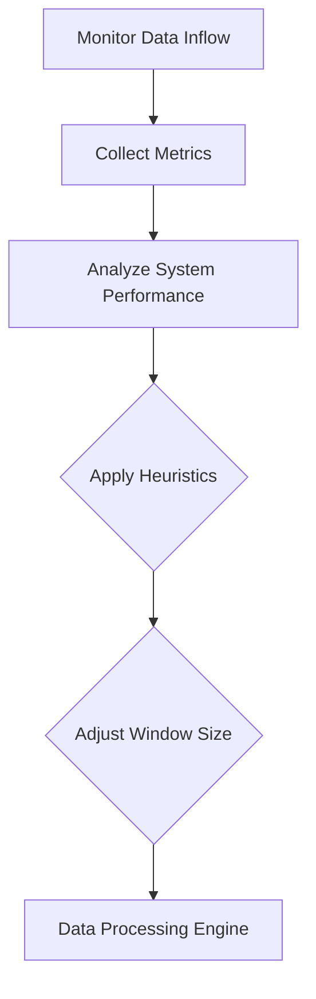

## Introduction

Adaptive Windowing is a design pattern in stream processing systems that involves dynamically adjusting the window sizes used to group data streams based on specific criteria. This pattern is crucial when dealing with varying data characteristics or fluctuating system performance demands, providing an optimized approach for handling real-time data processing efficiently.

## Problem

In traditional windowing, fixed-size windows are used to segment data streams for analysis. However, this approach can lead to inefficiencies when dealing with variable data flows or when system workloads change dramatically over time. Fixed windows can either become too large during low activity, wasting resources or too small during high throughput periods, causing bottlenecks and delayed processing.

## Solution

The Adaptive Windowing pattern addresses this problem by allowing window sizes to adjust dynamically based on data patterns or system metrics. This can be achieved through various algorithms or heuristics designed to monitor and respond to changes in data inflow rates, processing latencies, or resource utilization metrics.

### Key Components:

1. **Window Manager**: A component responsible for monitoring system and data metrics and deciding when and how to adjust window sizes.
2. **Metrics Collection**: Use of real-time metrics about data characteristics and processing loads to inform decision-making.
3. **Adaptive Logic**: Algorithms or heuristics that determine the adjustments needed for window sizes.
4. **Data Processing Engine**: The underlying stream processing component that executes computations using the defined windows.

## Example

Consider an e-commerce platform that experiences sharp spikes in traffic during sales events. An adaptive windowing system can be configured to increase window sizes during these periods, allowing the system to handle increased volumes efficiently without significant delays in real-time metrics computation such as orders per minute.

Here is a conceptual representation using pseudocode:

```typescript
function adaptWindowSize(dataStream) {
    let currentMetrics = collectMetrics(dataStream);
    let newSize = calculateNewWindowSize(currentMetrics);
    dataStream.setWindowSize(newSize);
}

function calculateNewWindowSize(metrics) {
    if (metrics.throughput > HIGH_THRESHOLD) {
        return LARGE_WINDOW_SIZE;
    } else if (metrics.throughput < LOW_THRESHOLD) {
        return SMALL_WINDOW_SIZE;
    } else {
        return DEFAULT_WINDOW_SIZE;
    }
}
```

## Diagram



## Related Patterns

- **Fixed Windowing**: Provides a contrast to Adaptive Windowing by using constant window sizes, suitable for stable environments.
- **Sliding Windowing**: Allows for overlapping window calculations addressing scenarios requiring frequent real-time updates with a fixed pattern.

## Best Practices

- **Metric Selection**: Choose relevant metrics that accurately reflect the data flow and processing load conditions.
- **Algorithm Design**: Develop efficient algorithms that can quickly adapt window sizes without incurring significant computational overhead.
- **Testing and Simulation**: Test the adaptive strategy in simulated environments before deploying it to production to fine-tune the heuristic parameters.

## Additional Resources

- [Apache Flink: Windowing Concepts](https://flink.apache.org/concepts#windows)
- [MillWheel: Fault-Tolerant Stream Processing at Internet Scale](https://research.google/pubs/pub41378/)

## Summary

Adaptive Windowing is a powerful pattern that offers flexibility and efficiency to stream processing solutions by enabling dynamic adjustments of window sizes based on real-time data and system performance metrics. This approach helps maintain optimal resource utilization and manage workload fluctuations efficiently, enhancing the responsiveness and resilience of data stream processing systems.
