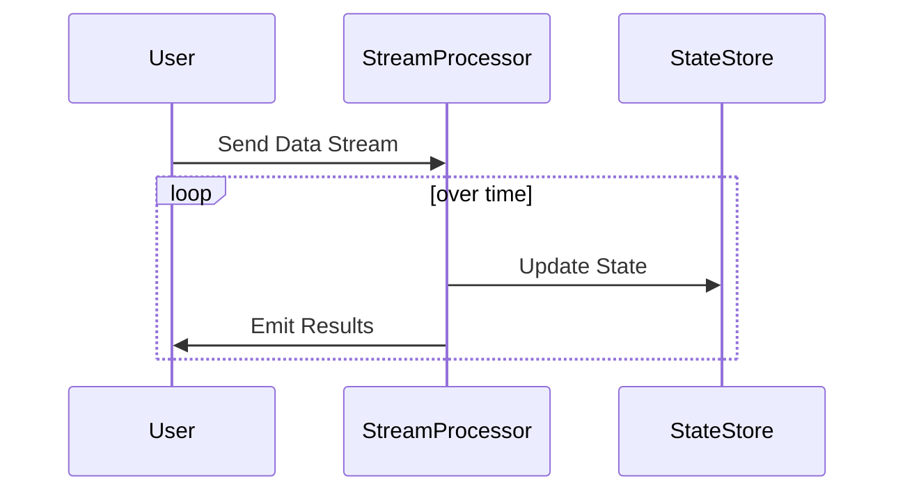

## Global Windows

### Description

The Global Windows pattern is a design pattern used in stream processing systems to collect and process an infinite stream of events within a single window. Unlike other windowing strategies, such as tumbling or sliding windows, Global Windows do not divide data into smaller subsets based on time or count. Instead, all incoming events are processed as part of a single, unbounded window. This pattern can be particularly useful in scenarios where the entire data history is relevant or where windowing is otherwise unnecessary.

### Architectural Approaches

- **Stateful Processing**: Global Windows rely heavily on state management since the entire dataset needs to be kept and processed continuously. Effective state management solutions, often using distributed state stores, are crucial for handling the growing data efficiently.

- **Fault-tolerance**: Ensuring fault-tolerance is important given the potentially unbounded nature of Global Windows. Techniques like checkpointing and state snapshots play an important role.

### Best Practices

1. **Efficient State Management**: Use robust state backend systems compatible with your streaming platform to manage the potentially large state arising from the Global Windows.

2. **Scaling and Load Balancing**: Monitor and adjust the resources based on the streaming system's performance, as Global Windows can lead to high resource usage due to unbounded state accumulation.

3. **Periodic Cleanup**: Implement mechanisms to prune obsolete data that may no longer be relevant, in order to prevent excessive state growth. 

4. **Define Clear Watermarks**: Particularly for out-of-order data, maintaining clear watermarks helps in defining boundaries for late events and in cleaning up state judiciously.

### Example Code

Here's a simple example using Apache Flink:

```java
import org.apache.flink.streaming.api.datastream.DataStream;
import org.apache.flink.streaming.api.environment.StreamExecutionEnvironment;
import org.apache.flink.streaming.api.windowing.assigners.GlobalWindows;
import org.apache.flink.streaming.api.windowing.triggers.CountTrigger;

public class GlobalWindowExample {
    public static void main(String[] args) throws Exception {
        StreamExecutionEnvironment env = StreamExecutionEnvironment.getExecutionEnvironment();
        
        DataStream<String> textStream = env.socketTextStream("localhost", 9999);
        
        textStream
            .windowAll(GlobalWindows.create())
            .trigger(CountTrigger.of(5)) // Optional trigger
            .reduce((value1, value2) -> value1 + value2)
            .print();
        
        env.execute("Global Window Example");
    }
}
```

### Diagrams



### Related Patterns

- **Tumbling Windows**: Segments data into fixed-size, non-overlapping windows, contrasting Global Windows where data accumulates indefinitely.

- **Sliding Windows**: Utilizes overlapping windows for data aggregation, providing insight into changing data patterns over time.

### Additional Resources

- [Apache Flink Documentation on Windowing](https://nightlies.apache.org/flink/flink-docs-release-1.14/docs/dev/datastream/operators/windows/)
- [Google Cloud's Concepts on Stream Processing](https://cloud.google.com/dataflow/docs/concepts/streaming-with-cloud-dataflow)
- [Understanding Window Aggregations in Apache Kafka Streams](https://kafka.apache.org/documentation/streams/)

### Summary

Global Windows serve a specific purpose within stream processing workloads, allowing for the perpetual aggregation of data without window segmentation. Though simple, the pattern demands robust state management practices due to potential state accumulation. Its application is best suited for scenarios where aggregate insights across the complete dataset are more critical than insights over discrete periods. When implementing Global Windows, strategizing around resource management, fault tolerance, and state cleanup is essential to maintain system performance and reliability.
