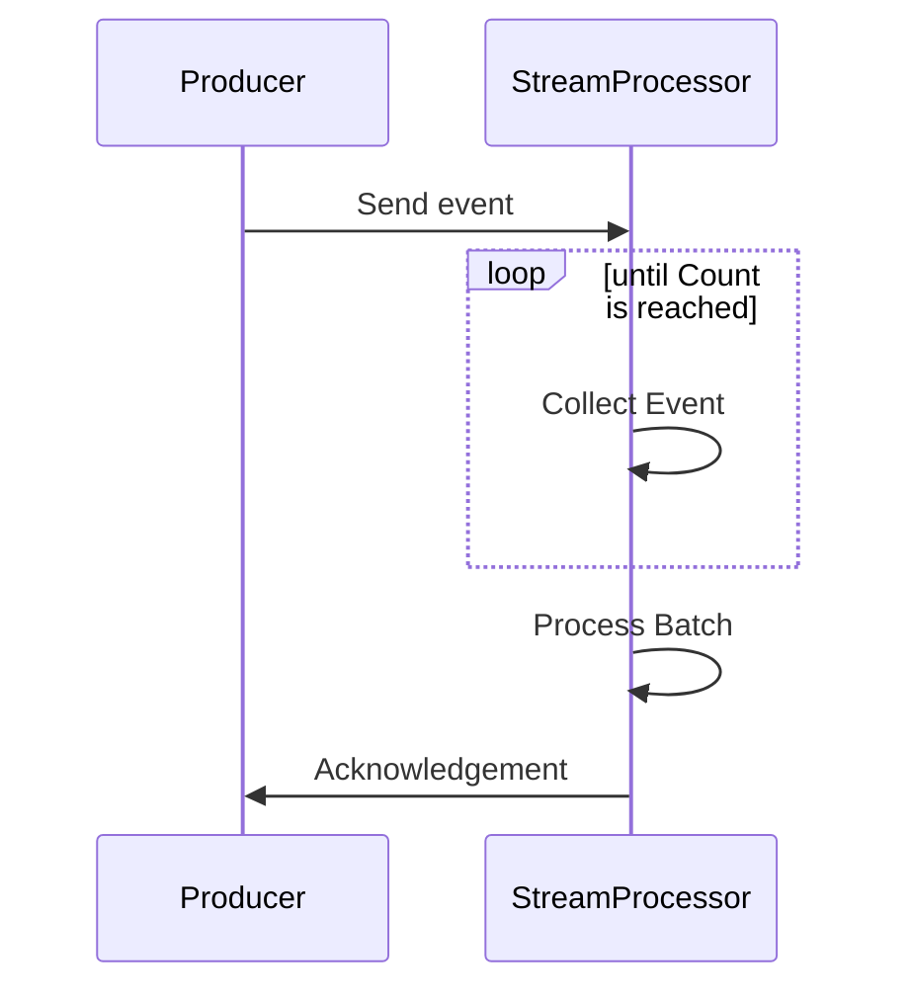

## Introduction

Count Windows are a critical design pattern in stream processing that allows for deterministic control over data processing based on the number of events. This pattern is particularly useful in scenarios where processing every 'n' events in a stream is necessary, ensuring scalability and efficiency in data management.

## Explanation of Count Windows

Count Windows collect and process events based on a predefined count, allowing systems to execute business logic once the specified number of events is reached. This pattern is advantageous in high-throughput data processing, where real-time analysis and batch processing are both required.

### Characteristics

- **Fixed Size**: Count Windows have a predetermined size, such as processing every set of 100 events.
- **Event-Driven**: Since processing is triggered by the number of events rather than a time interval, it is highly responsive and adaptive to the flow of incoming data.
- **Scalability**: This approach simplifies resource management because it processes batches of events together.
- **Deterministic Output**: The output is consistent and predictable as each window processes exactly the same number of events.

## Architectural Approach

### Implementation Steps

1. **Define the Count**: Specify a count that the window should collect before triggering a processing operation (e.g., 100 events).
2. **Event Collection**: As events flow into the system, they are added to the current window until the count is reached.
3. **Trigger Processing**: Once the window size is met, execute the necessary processing, which may include aggregations, transformations, etc.
4. **Restart Window**: After processing, the window resets and begins collecting the next n events.

### Technologies and Solutions

- **Apache Kafka Streams**: Use Kafka Streams' Count Windows functionality to process streams of data in real-time efficiently.
- **Apache Flink**: Provides straightforward APIs for implementing Count Windows, allowing dynamic batching based on events.
- **Google Cloud Dataflow**: Offers tools for event-based windowing in Dataflow and Beam, which can be used to implement Count Windows.

## Best Practices

- **Selection of Appropriate Count**: Choose a count size that balances processing latency and volume to ensure efficient resource use.
- **Monitoring and Logging**: Implement monitoring to manage window flow and adjust the count size dynamically if necessary.
- **Error Handling**: Ensure that any processing errors are gracefully handled, allowing the window to reset reliably.

## Example Code

Here's an example of implementing Count Windows using Apache Flink in Java:

```java
DataStream<Event> eventStream = ...;

eventStream
  .keyBy(event -> event.getKey())
  .countWindow(100) // Define Count Window for every 100 events
  .reduce((event1, event2) -> process(event1, event2))
  .print();
```

## Diagrams

### Sequence Diagram



## Related Patterns

- **Sliding Windows**: A related pattern that involves overlapping windows based on time or count.
- **Event Time Windows**: Windows based on event time rather than processing time, useful in ordered data scenarios.

## Additional Resources

- [Apache Flink Documentation](https://flink.apache.org/)
- [Kafka Streams Documentation](https://kafka.apache.org/documentation/streams/)
- [Google Cloud Dataflow](https://cloud.google.com/dataflow)

## Summary

Count Windows are a powerful and flexible pattern for processing streams based on event counts. By enabling precise control over the processing of data, Count Windows support high-throughput applications while maintaining simplicity and predictability. Coupled with modern stream processing tools, they continue to be a cornerstone of robust real-time data processing architectures.
