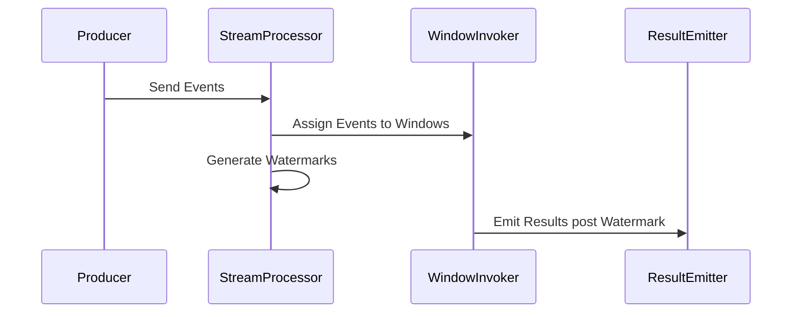

## **Watermarking Windows**

### **Description**

The Watermarking Windows design pattern is a strategic approach in stream processing to handle late or out-of-order events. In real-time data processing systems, such as those managing sensor data or user interactions, data often arrives at different intervals due to network lags or producer delays. To manage computations with accuracy, Watermarking Windows leverages the concept of _watermarks_, allowing systems like Apache Flink to provide a balance between accuracy and latency.

Watermarks are timestamps that represent how far the system has progressed in event time. They indicate a point in time up to which data is considered complete for processing and help in deciding when results from windowed computations should be emitted.

### **Architectural Overview**

1. **Event Time vs. Processing Time**: The fundamental distinction between when data is generated (event time) vs. when it is processed. Handling event-time complexities can improve result accuracy.

2. **Watermarks as Progress Indicators**: Watermarks flow with the event stream and represent the system's notion of completeness with respect to event times. They allow the system to emit window results even in the face of late data.

3. **Late Event Handling**: Allows specification of late event acceptance up to a predefined interval beyond the watermark. This provides a buffer, improving accuracy without indefinite delays.

4. **Integration in Stream Processing Frameworks like Flink**: Watermarks are integral in systems like Flink, where they trigger operations once they surpass the end-of-window timestamps.

### **Example Code: Using Watermarks in Apache Flink**

Below is an example of defining watermarks in Apache Flink for streaming applications:

```java
DataStream<Event> eventStream = ...;

DataStream<Event> withWatermarks = eventStream
    .assignTimestampsAndWatermarks(WatermarkStrategy
        .<Event>forBoundedOutOfOrderness(Duration.ofSeconds(5))
        .withTimestampAssigner((event, timestamp) -> event.getEventTime()));

withWatermarks
    .keyBy(Event::getKey)
    .window(TumblingEventTimeWindows.of(Time.minutes(1)))
    .apply(new WindowFunction<>())
    .print();
```

### **Mermaid Sequence Diagram**



### **Related Patterns**

- **Tumbling Windows**: Fixed-size, non-overlapping windows; can be used with watermarks for non-delayed result emission.
  
- **Sliding Windows**: Overlapping windows, which can also employ watermarks to handle the sliding window results with late arrivals efficiently.

- **Session Windows**: Defined by periods of inactivity, where watermarks assist in determining end of sessions despite delays in event arrival.

### **Best Practices**

- **Tune Watermark Frequencies**: Depending on the desired balance between accuracy and latency, optimize the frequency and interval of watermark generations.
  
- **Determine Tolerance for Late Events**: Setting a reasonable tolerance window is crucial to align with business logic requirements versus computational overhead.

- **Monitor and Adjust**: Stream processing workloads should be closely monitored to adjust watermark strategies dynamically for changing data patterns.

### **Additional Resources**

- **Apache Flink Documentation**: Detailed usage of watermarks and event time processing.
- **Stream Processing: Algorithms and Techniques**: Insights into advanced stream processing efforts, watermark inclusion, and late event management strategies.

### **Summary**

The Watermarking Windows design pattern provides a robust framework for dealing with the intrinsic challenges of late and out-of-order data in real-time streaming applications. By incorporating watermarks, systems like Apache Flink can align processing nearer to actual event time, enhancing the precision of results while remaining adaptable to the lateness inherent to distributed data flows. Utilizing this pattern involves strategic tuning and ongoing adjustments to sustain optimal accuracy and performance in your stream processing workloads.
