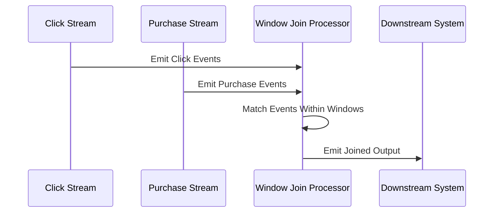

## Overview

The Window Join pattern is a crucial technique in stream processing where data from two separate streams is matched or joined based on temporal windows. The primary goal is to ensure that events from both streams are aligned within the same time frame, capturing temporally relevant insights. This pattern is particularly valuable in scenarios where related events occur around the same time and need to be analyzed collectively, such as understanding the conversion rates by associating click events with subsequent purchase events.

## What is a Window Join?

A window join combines events from two data streams into a single, unified view based on defined time windows. Each window represents a time period, and only the events falling within the same window are candidates for joining. Through this technique, downstream analytics can extract meaningful patterns based on temporally correlated data.

## Architectural Approach

### Components and Flow

1. **Stream Ingestion**: Collects raw events from two source streams. Examples might be user clicks and purchase records.

2. **Window Specification**:
   - **Window Size**: Defines the duration of each window, e.g., 10 minutes.
   - **Sliding or Tumbling Windows**: Configures how the windows behave over time. A sliding window moves across the timeline to capture overlapping events, while a tumbling window provides discrete, non-overlapping time periods.

3. **Window Matching**: Identifies events within the same temporal window from each stream and pairs them for further processing.

4. **Processing Logic**: Applies additional business logic or transformations, such as filtering or aggregating matched events.

5. **Output Generation**: Delivers the results to a downstream system for reporting, storage, or real-time dashboards.

### Example Code

Here’s a conceptual example using Flink, a popular stream processing framework:

```java
StreamExecutionEnvironment env = StreamExecutionEnvironment.getExecutionEnvironment();

// Define input streams
DataStream<ClickEvent> clickStream = env.fromSource(clickSource, ...);
DataStream<PurchaseEvent> purchaseStream = env.fromSource(purchaseSource, ...);

// Apply Window Join (Assume both events have a timestamp field)
DataStream<JoinedEvent> joinedStream = clickStream
  .join(purchaseStream)
  .where(click -> click.getUserId())
  .equalTo(purchase -> purchase.getUserId())
  .window(TumblingEventTimeWindows.of(Time.minutes(10)))
  .apply((click, purchase) -> new JoinedEvent(click, purchase));

joinedStream.print();
```

### Diagram



## Best Practices

- **Select Appropriate Window Sizes**: Ensure that the window size reflects the expected temporal relationship between events. Too small windows may miss relevant event pairs, while too large can dilute specificity.

- **Tuning for Latency vs. Completeness**: Balance the need for low-latency processing with the requirement of ensuring as many relevant matches as possible.

- **State Management**: Efficient state management is crucial, as windows may need to hold substantial amounts of data, especially with longer window durations.

## Related Patterns

- **Aggregation**: Often used in conjunction with window join to summarize or compute statistics on joined data.
  
- **Filters and Conditions**: Refinements on events post-join to ensure only relevant matches are retained.

- **Watermarks**: Handle late-arriving events and manage out-of-order data.

## Additional Resources

- **Apache Flink Documentation**: Offers in-depth coverage of windowing and joining patterns.
  
- **Google Cloud Dataflow**: Discusses similar windowing and joining concepts in its streaming capabilities.

## Summary

The Window Join pattern is indispensable for stream processing systems that require temporal synchronization between streams, providing a mechanism to compute insights based on time-windowed data correlations. Proper implementation enhances the ability to derive actionable insights in real-time while addressing challenges related to data integration and time-critical event processing.
