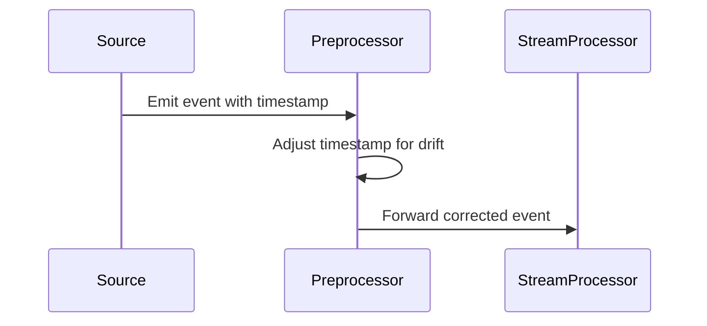

## Introduction
Time Drift Correction is a critical design pattern in stream processing systems where precise event time management is essential. This pattern addresses the challenges that arise when clock drift or synchronization issues lead to misaligned event timestamps. By employing this pattern, systems can adjust timestamps accordingly, ensuring that event processing is carried out with accurate temporal information.

## Detailed Explanation

### Problem Context
In distributed systems, especially those processing real-time data streams, event timestamps might not precisely align with the actual occurrence time due to:
- Clock drift on data-generating devices.
- Network delays impacting synchronization protocols.
- Timezone discrepancies between different data sources.

Such discrepancies can lead to inaccurate results during event time-based operations like windowing, event correlation, and latency measurement.

### Solution
To mitigate the effects of time drift, the Time Drift Correction pattern involves the following steps:

1. **Identify Drift Source**: Determine known sources of clock drift or synchronization issues within your system.
2. **Calculate Adjustment**: Quantify the time drift — for instance, if a data source consistently timestamps events 30 seconds late.
3. **Adjust Timestamps**: During preprocessing or at the stream ingress, adjust event timestamps by adding or subtracting the calculated drift. 

### Implementation Strategies
- **Static Correction**: For data sources with known, consistent drift, apply a fixed timestamp correction.
- **Dynamic Adjustment**: Continuously monitor clock drift using synchronization protocols (like NTP) and adjust timestamps dynamically based on real-time drift metrics.

### Example
Consider a stream processing application receiving events from IoT devices, where the devices are known to be 30 seconds behind the true time. The application can preprocess events by adding 30 seconds to each timestamp before further processing:
   
```scala
def correctTimestamp(event: Event): Event = {
  val correctedTimestamp = event.timestamp + 30.seconds
  event.copy(timestamp = correctedTimestamp)
}
```

## Diagrams

### UML Sequence Diagram using Mermaid


## Related Patterns
- **Time Windowing**: Often used alongside the Time Drift Correction pattern to ensure window measurements reflect actual event times.
- **Watermarking**: Helps manage lateness by providing lower bounds on event time progress after correction.
- **Event Time Selection**: This pattern decides which timestamp should be adjusted before processing.

## Best Practices
- Ensure clear documentation of assumptions around drift times and periodic reviews to accommodate any hardware or network changes.
- Integrate robust clock synchronization tools.
- Periodically validate timestamp accuracy against a reliable external time source.

## Additional Resources
- **White Paper**: "Understanding Clock Synchronization in Distributed Systems" – A detailed explanation of synchronization strategies.
- **Library**: Apache Kafka Streams and its time synchronization features.
- **Tool**: NTP (Network Time Protocol) configuration and usage guidelines.

## Summary
The Time Drift Correction pattern is crucial for maintaining the integrity of event-time-driven applications. By adjusting event timestamps to account for known drift, systems can continue to process and analyze streaming data correctly, preserving the accuracy and reliability of time-dependent operations.

