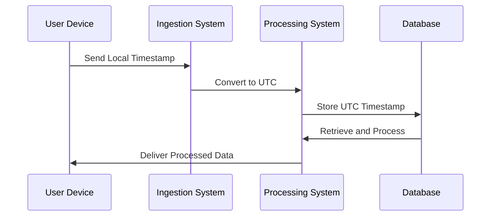

## Overview

Time Zone Management is a crucial design pattern in stream processing systems, particularly for applications that handle data from multiple geographic regions. It involves standardizing event timestamps to a single time zone (usually Coordinated Universal Time, UTC) to ensure consistency in processing and analysis. This pattern is essential because discrepancies in time zone handling can lead to incorrect aggregations and analytics results, impacting the reliability of real-time data-driven decisions.

## Architectural Approach

1. **Time Zone Normalization**:
   - Convert all incoming event timestamps to a common time zone, typically UTC.
   - Use libraries and tools that support robust date-time operations to cater to daylight saving time adjustments and other time zone peculiarities.

2. **Time Zone Aware Data Ingestion**:
   - Embed time zone information within event data or metadata.
   - Allow for the ingestion systems to automatically detect and convert timestamps if not explicitly set.

3. **Time Zone Consistent Processing**:
   - Implement time zone-aware data models that maintain or reference the original time zone information.
   - Ensure processing systems (like Apache Kafka Streams, Apache Flink) are configured to handle time zone conversions accurately.

## Best Practices

- **Centralized Time Zone Configuration**: Configure all applications to use a centralized, consistent time zone setting to avoid discrepancies in timestamp handling.
  
- **UTC as Standard**: Use UTC as the standard reference time zone to avoid issues with local time changes (like daylight saving shifts).

- **Testing and Validation**: Implement rigorous testing to ensure all time zone conversions are functioning as expected, particularly in edge cases around daylight saving shifts.

- **Monitoring and Logging**: Include comprehensive logging to capture any anomalies in time zone conversion for easier debugging and monitoring.

## Example Code

Below is an example of handling timestamps in Java using the `java.time` package to normalize to UTC:

```java
import java.time.ZonedDateTime;
import java.time.ZoneId;
import java.time.format.DateTimeFormatter;

public class TimeZoneManagement {
    public static void main(String[] args) {
        String originalTimestamp = "2024-07-07T14:30:00";
        ZoneId originalZoneId = ZoneId.of("America/New_York");
        ZonedDateTime zonedDateTime = ZonedDateTime.parse(originalTimestamp, 
                DateTimeFormatter.ISO_LOCAL_DATE_TIME.withZone(originalZoneId));

        ZonedDateTime utcDateTime = zonedDateTime.withZoneSameInstant(ZoneId.of("UTC"));
        System.out.println("Original Time: " + zonedDateTime);
        System.out.println("Converted to UTC: " + utcDateTime);
    }
}
```

## Diagrams

### Time Zone Normalization Flow



## Related Patterns

- **Time Series Data Pattern**: Focuses on the efficient storage and retrieval of timestamped data.
- **Data Cleaning Pattern**: Involves preprocessing steps that include time zone adjustments as part of data quality improvements.
- **Event Streaming Pattern**: Manages the real-time processing of data streams that often spans multiple time zones.

## Additional Resources

- [Official Java Documentation on `java.time`](https://docs.oracle.com/javase/8/docs/api/java/time/package-summary.html)
- [Apache Kafka Streams: Time Concepts](https://kafka.apache.org/24/documentation/streams/using.html#timestamps)
- [The importance of UTC in System Design](https://engineering.example.com/blog/time-zones-and-system-design)

## Summary

Managing time zones is an integral aspect of designing robust stream processing systems. By converting all event times to a common time zone such as UTC, we ensure consistency across all data partitions and analyses. This practice not only simplifies system design but also enhances data reliability, leading to more accurate and timely data-driven decisions.
