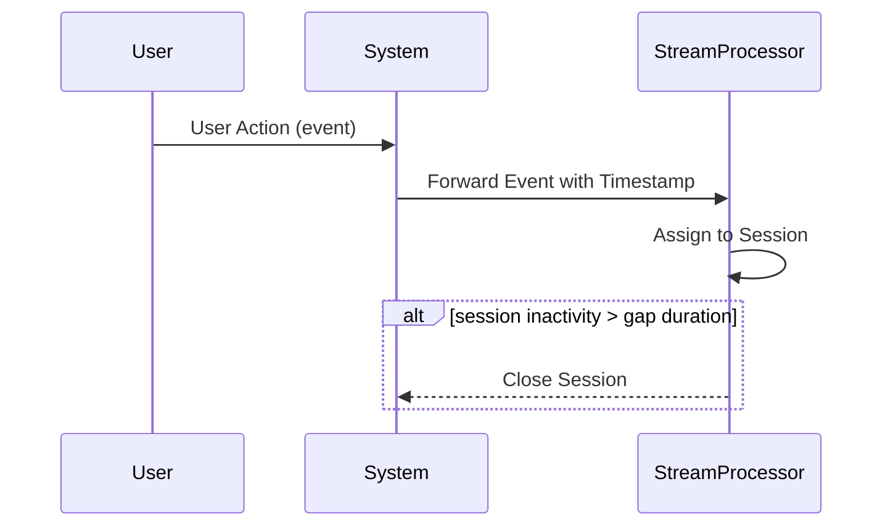

## Overview

Session windowing with event time is a powerful design pattern used in stream processing to group related events into sessions. Instead of relying on processing time, which can be several microseconds to minutes after the event origination, event time considers the actual timestamps of the data, enabling accurate analysis, particularly useful for applications such as user activity tracking and anomaly detection.

## Detailed Explanation

### Design Pattern

Session windowing dynamically defines windows of arbitrary duration around a sequence of events. Unlike tumbling and sliding windows, which have pre-defined and potentially fixed intervals, session windows group events based on a gap duration—commonly referred to as timeout. When events occur, they are assigned to a session, and sessions are terminated after a period of inactivity defined by this timeout.

### Key Concepts

- **Event Time**: The actual time when the event was generated. This is often embedded within the event and is used for better alignment with the real-world chronology of the events.
- **Inactivity Gap Duration**: A configurable threshold that defines the maximum time between events that are considered part of the same session. If exceeded, the session is closed.
- **Late Events Handling**: Mechanisms are often provided to incorporate late-arriving events into the appropriate sessions or take special handling measures if that's not possible.

### Benefits

- **Accuracy**: By using event time, the analysis accurately reflects real-world event occurrence.
- **Handling of Late Events**: Most stream processing frameworks have sophisticated tooling to handle late events, ensuring inclusion in analysis windows where appropriate.
- **Dynamic Session Length**: Sessions automatically adapt their size based on user activity, making the system flexible and efficient.

## Example Code

Below is an example implementation of session windowing using Apache Flink, a common stream processing framework. This example sessionizes user actions with a timeout of 30 minutes:

```java
DataStream<Event> events = ...;

DataStream<SessionedEvent> sessions = events
    .keyBy(event -> event.getUserId())
    .window(EventTimeSessionWindows.withGap(Time.minutes(30)))
    .process(new ProcessWindowFunction<Event, SessionedEvent, String, TimeWindow>() {
        @Override
        public void process(String key, Context context, Iterable<Event> input, Collector<SessionedEvent> out) {
            List<Event> eventList = new ArrayList<>();
            input.forEach(eventList::add);
            out.collect(new SessionedEvent(key, eventList, context.window().getStart(), context.window().getEnd()));
        }
    });
```

## Diagrams

### Mermaid Sequence Diagram



## Related Patterns

- **Tumbling Windows**: Fixed-size, non-overlapping windows.
- **Sliding Windows**: Fixed-size, overlapping windows with user-defined sliding intervals.

## Additional Resources

1. [Apache Flink Documentation on Windowing](https://flink.apache.org/)
2. [Concepts in Stream Processing: Windows](https://kafka.apache.org/documentation/streams/)

## Summary

Session windowing with event time is an essential design pattern in stream processing that caters to dynamic, real-world event data, offering precise analysis through adept handling of session duration and late arrivals. Its usage is prevalent in scenarios such as user behavior analysis, fraud detection, and more, where timely and ordered data processing is pivotal.
