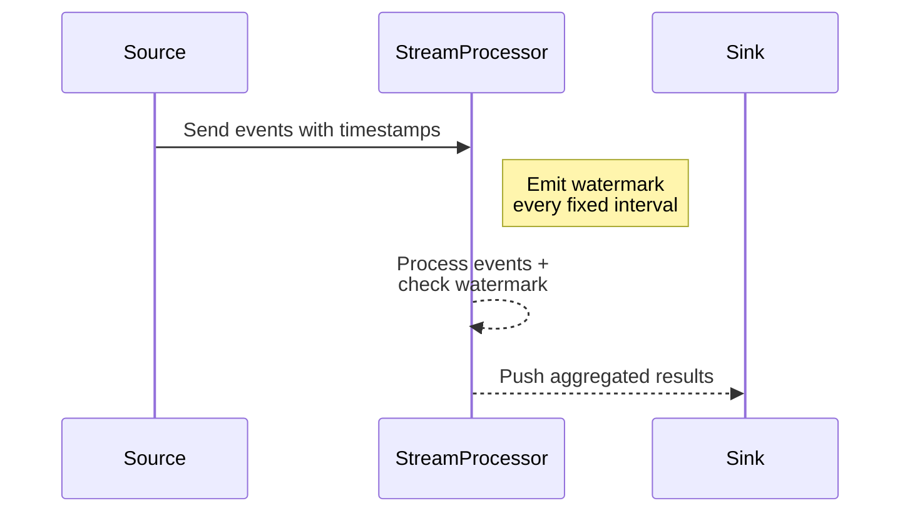

## Introduction

In stream processing, handling the timing of events is crucial for producing accurate insights and aggregations. "Event Time Watermarks" is a design pattern used to manage temporal aspects of streams, specifically event time windowing. Watermarks help to track progress in event time, allowing systems to handle late-arriving data while providing consistent results.

## Design Pattern Category

**Event Time vs. Processing Time Patterns**

## Detailed Explanation

### Event Time and Watermarks

In stream processing:

- **Event time** refers to the timestamp embedded within data events, indicative of when the event occurred.
- **Processing time** refers to the time at which the event is processed by the streaming application.

To accurately manage and analyze event time windows, systems can utilize **watermarks**. A watermark is a mechanism used to declare the progress in event time. It acts as a threshold that defines until which point any incoming or late events are included in current window calculations.

### Watermark Strategies

#### Fixed Delay Watermarks

A common strategy is to emit watermarks based on a fixed delay behind the maximum observed event time. This approach assumes late events may arrive within a predictable delay.

```scala
val watermarkStrategy = WatermarkStrategy
  .forBoundedOutOfOrderness[MyEvent](Duration.ofMinutes(5))
  .withTimestampAssigner((event: MyEvent, timestamp: Long) => event.eventTime)
```

#### Incremental Watermarks

Incremental watermarks progress the watermark gradually based on the accumulation of events, using logic that adjusts adaptively. This method suits streams with significant variance in event arrival times.

### Handling Late Events

When watermarks are effectively used, any event arriving after the latest watermark is marked as late. Systems often employ strategies to manage late events, such as keeping the state open for these events with specific expiry policies.

## Example Scenario

Imagine a streaming application involved in traffic management, where sensors generate vehicle count data with timestamps (event time). Event time windowing allows aggregation of vehicle counts into minute-based windows. Watermarks help process this data, so if a data point arrives later but falls within the watermark's delay, it's still computed into the relevant window.

## Diagrams

Below is a Mermaid UML sequence diagram illustrating a basic event time processing flow with watermarks:



## Related Patterns

- **Windowed Joins**: Leveraging watermarks in joins to handle synchronization.
- **Late Data Triggering**: Specific strategies for managing and re-processing late-arriving data within windowed aggregations.

## Additional Resources

- **Apache Flink's Watermark Mechanism**: An in-depth look at watermarks in Apache Flink.
- **Confluent Kafka Streams Documentation**: How Kafka Streams manages time and event-driven processing with watermarks.

## Summary

Using watermarks in event time processing is essential for efficiently managing window computations and handling late events in real-time stream processing systems. By correctly leveraging watermarks, you ensure accurate and timely window-based aggregations, even when data arrives with inherent delays.
