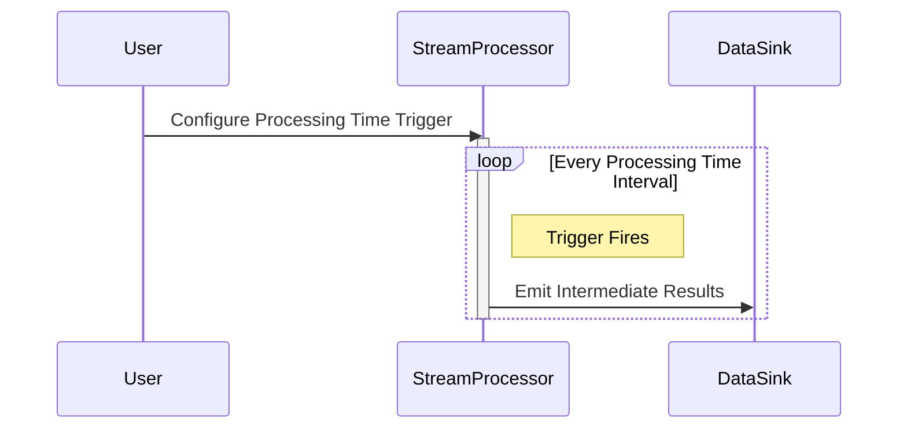

## Processing Time Triggers

When working with stream processing systems, **Processing Time Triggers** represent an essential design pattern. They allow scheduled computations or actions based on the processing time rather than the event's time of occurrence. This approach is particularly useful for tasks requiring regular updates at predictable intervals, offering timely visibility into data streams irrespective of the event timing.

### Detailed Explanation

- **Processing Time Basics**: This is the system's wall-clock time when an event is processed, not when it was generated.
  
- **Functionality**: Processing time triggers initiate actions at regular intervals based on the processing system's clock. They don’t wait for event timestamps, which are often much more challenging to synchronize across distributed systems.

- **Use Case Scenarios**: 
  - Regularly updated dashboards that display near-real-time data.
  - Emitting partial results in long-running processes to provide insights before the final computation.
  - Aggregating metrics for service-level monitoring that cannot tolerate waiting for late events.

- **Benefits**:
  - **Simplicity and Performance**: By relying solely on the processing time, systems can significantly simplify their logic and improve processing throughput.
  - **Predictability**: Regular processing time intervals provide consistent and predictable updates, benefiting applications needing frequent monitoring or reporting.

### Example Code

Here is a pseudocode example demonstrating processing time triggers in a stream processing system:

```scala
val dataStream = createStream("data-source")

// Define a processing time trigger that fires every minute
val processingTimeTrigger = ProcessingTimeTrigger.create()
  .withInterval(Duration.ofMinutes(1))

// Apply the processing time trigger to a windowed aggregation
val resultStream = dataStream
  .windowAll(TumblingProcessingTimeWindows.of(Time.minutes(5)))
  .trigger(processingTimeTrigger)
  .aggregate(new MyAggregateFunction)
  
resultStream.print()
```

### Diagram

Below is a simple Mermaid UML sequence diagram showing how processing time triggers work:



### Related Patterns

- **Event Time Triggers**: Trigger actions based on event time, useful in systems tolerant of out-of-order events.
  
- **Watermarks**: Mechanisms to handle event time, ensuring that out-of-order events can be effectively dealt with while still using processing time triggers.

### Additional Resources

- [Google Cloud Dataflow Model](https://cloud.google.com/dataflow/model)
- [Understanding Apache Flink’s Event Time and Processing Time](https://flink.apache.org/)
- [Stream Processing Design Patterns in AWS Kinesis](https://aws.amazon.com/kinesis/)

### Summary

**Processing Time Triggers** provide an efficient mechanism for time-based computation in stream processing environments. They are straightforward to implement, ensure regular updates, and circumvent the complexities associated with correctly handling event time. This makes them ideally suited for applications where timeliness and simplicity are crucial considerations, such as monitoring and real-time analytics. By adopting processing time triggers, developers can build responsive systems that deliver consistent performance and reliability.
