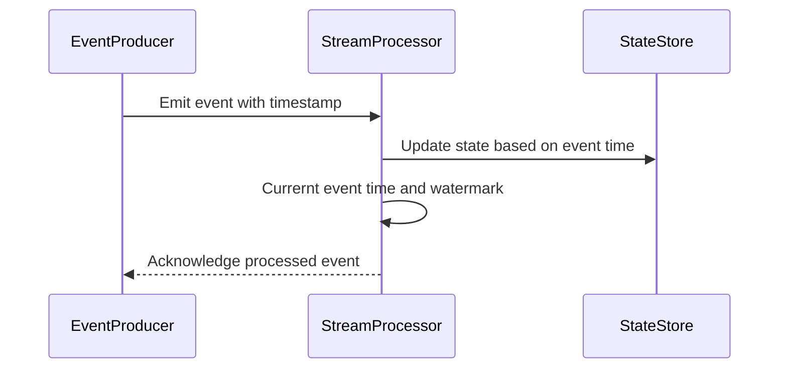

## Introduction

Time-Aware State Management is a design pattern essential for real-time and event-driven applications, especially within stream processing frameworks. It addresses the need to manage application state with a clear understanding of event timestamps, distinct from the system's processing time. This approach ensures that applications maintain the integrity and correctness of the results in scenarios involving out-of-order events and various event latencies.

## Design Pattern Overview

- **Objective**: The primary goal is managing state efficiently in reaction to event time, enabling state updates or expirations based on precise event timestamps rather than relying on processing time, which may not accurately reflect when events occurred.
- **Use Case Example**: A streaming application that tracks user activity over daily windows might need to reset its counters at the end of each day based on the event timestamps rather than the server's processing time.

## Architectural Approaches

1. **Event Time Processing**:
   - Utilize event time provided by the event metadata for accurate state management.
   - Employing watermarks to handle late-arriving events by setting thresholds for lateness.

2. **Time-Based Windows**:
   - Implement tumbling, sliding, or session windows based on event time to manage state appropriately within defined time frames.
   - Align window boundaries to human-understood times (e.g., daily, hourly).

3. **State Expiration**:
   - Define expiration policies for state entries based on event time to prevent memory leaks and ensure resource availability.
   - Leverage time-to-live (TTL) settings with respect to event time.

## Example Code

Here's a simplified example using Apache Flink for managing a daily count of events per key, resetting at midnight:

```java
import org.apache.flink.api.common.time.Time;
import org.apache.flink.api.java.tuple.Tuple2;
import org.apache.flink.streaming.api.TimeCharacteristic;
import org.apache.flink.streaming.api.datastream.DataStream;
import org.apache.flink.streaming.api.environment.StreamExecutionEnvironment;
import org.apache.flink.streaming.api.functions.windowing.WindowFunction;
import org.apache.flink.streaming.api.windowing.time.Time;
import org.apache.flink.streaming.api.windowing.windows.TimeWindow;
import org.apache.flink.util.Collector;

public class TimeAwareStateManagement {

    public static void main(String[] args) throws Exception {
        StreamExecutionEnvironment env = StreamExecutionEnvironment.getExecutionEnvironment();
        env.setStreamTimeCharacteristic(TimeCharacteristic.EventTime);

        DataStream<Tuple2<String, Long>> eventStream = // source of events

        eventStream
            .keyBy(event -> event.f0)
            .timeWindow(Time.days(1))
            .apply(new CountPerKeyWindowFunction())
            .print();

        env.execute("Time-Aware State Management Example");
    }

    public static class CountPerKeyWindowFunction 
        implements WindowFunction<Tuple2<String, Long>, Tuple2<String, Long>, String, TimeWindow> {

        @Override
        public void apply(String key, TimeWindow window, Iterable<Tuple2<String, Long>> input, Collector<Tuple2<String, Long>> out) {
            long count = 0;
            for (Tuple2<String, Long> event : input) {
                count++;
            }
            out.collect(new Tuple2<>(key, count));
        }
    }
}
```

## Diagrams



## Related Patterns

- **Event Sourcing**: Another state management pattern, capturing state transitions as a sequence of events.
- **Windowing in Stream Processing**: Aggregating events into windows for batch-like state processing.

## Additional Resources

- [Understanding Time and State in Stream Processing](https://flink.apache.org)
- [Temporal Logic in Stream Processing](https://example.com/temporal-logic)

## Summary

Time-Aware State Management addresses a critical need in modern data-driven applications by allowing systems to manage state in tight alignment with the event time. This pattern ensures correctness and accuracy, especially in real-time analytics and monitoring solutions. By adopting strategies like event-time-based windows and setting up time-aware state expiration policies, developers can build robust and reliable stream processing applications.
