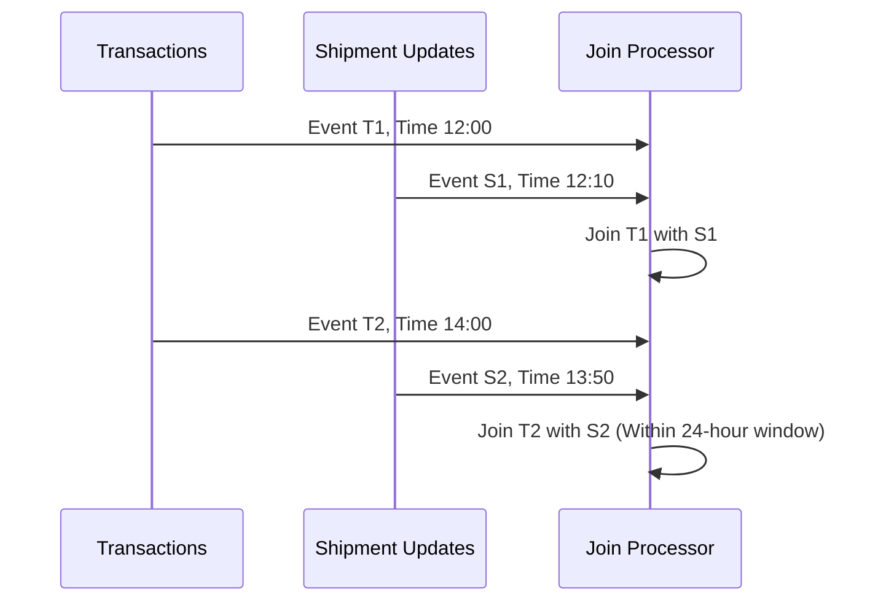

## Temporal Joins

### Description

Temporal Joins are a design pattern used in stream processing where events from different sources are joined based on their event time (timestamps) rather than processing time. This pattern ensures that related events are combined, even if they are processed at different times due to network delays or out-of-order arrival. A common use case is integrating transactions with corresponding updates or actions that occur within a specific temporal window.

### Architectural Approach

To implement Temporal Joins:

1. **Stream Partitioning**: Events must be partitioned by a key to ensure that related events end up on the same processing node.
   
2. **Event Time Management**: Systems need to maintain event time watermarks or windows to track the progression of time and correctly align event timestamps.

3. **Window Mechanisms**: Use windowing strategies like sliding, tumbling, or session windows to group events that can be joined based on event time.

4. **State Management**: Maintain state for each join key to buffer events until they can be joined, handling late or out-of-order events to a certain degree.

### Best Practices

- **Clock Synchronization**: Ensure all system clocks are synchronized to reduce discrepancies between event times across distributed components.
  
- **Late-Arrival Handling**: Decide on a strategy for late-arriving data, such as storing the event for later use or updating previously processed results.

- **Fault Tolerance**: Implement robust state management and checkpointing mechanisms to recover from failures without losing critical join state.

### Example Code

Here's a simple Kafka Streams example illustrating Temporal Joins:

```java
KStream<String, Transaction> transactions = builder.stream("transactions");
KStream<String, ShipmentUpdate> shipmentUpdates = builder.stream("shipment-updates");

KStream<String, String> joinedStream = transactions.join(
    shipmentUpdates,
    (transaction, shipment) -> "Transaction ID: " + transaction.getTransactionId() + ", Shipment Status: " + shipment.getStatus(),
    JoinWindows.of(Duration.ofHours(24)),
    Joined.with(Serdes.String(), Serdes.serdeFrom(Transaction.class), Serdes.serdeFrom(ShipmentUpdate.class))
);

joinedStream.to("joined-output-topic");
```

### Diagrams

Here is a simple example using Mermaid to visualize the Temporal Join process:



### Related Patterns

- **Windowed Joins**: Joins occurring within fixed time windows, useful when dealing with large-scale streaming data.

- **Out-of-Order Event Handling**: Strategies for processing or re-ordering late events in streaming systems.

- **Data Skew Mitigation**: Techniques to address performance issues arising from uneven distribution of join keys.

### Additional Resources

- [Stream Processing with Apache Kafka](https://kafka.apache.org/documentation/streams/)
- [Stateful Stream Processing in Flink](https://flink.apache.org/)
- [The Beam Model: Writing Data Processing Pipelines](https://beam.apache.org/documentation/programming-guide/)

### Summary

Temporal Joins enable precise and meaningful integration of events in stream processing by focusing on event time rather than processing order. By leveraging this pattern, systems can maintain data accuracy and consistency across distributed environments, ensuring reliable and timely insights for real-time analytics.
