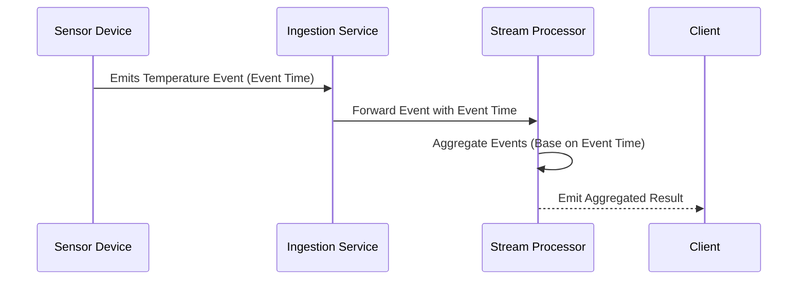

## Introduction

Time-Based Aggregations are stream processing patterns crucial in scenarios where the temporal accuracy of data processing is of paramount importance. This pattern relies on event time, as opposed to processing time, to compute aggregated results. This ensures that even with the inherent delays in data arrival, the true timing of the event is respected, allowing for more consistent and reliable analytics, such as calculating statistics or metrics over time windows.

## Context

In stream processing, events may arrive out of order or with delays, typically due to network issues or system latencies. If aggregations were based solely on processing time—when events happen to arrive at a processing system—you could end up with misleading analytics, particularly in applications like financial transactions, sports analytics, or IoT sensor data, where the timing of events holds significant value.

## Problem

Design a pattern that aggregates streaming data based on the actual event time rather than the time the data was processed, to provide accurate metrics and analyses. This involves handling late or out-of-order data effectively to ensure that the computed aggregates reflect the true order and timing of events.

## Solution

- **Event Time**: Use timestamps attached to each event indicating when the event occurred. Systems generating events must timestamp or ensure reliable time synchronization.
  
- **Windowing**: Define a time window over which the aggregation will be computed (e.g., hourly, daily windows). Windows should be anchored based on event time.
  
- **Handling Late Data**: Implement mechanisms to handle late-arriving data, allowing updates to previously completed windows if necessary. This often involves buffering streams beyond the window duration and possibly triggering re-computation of aggregates.

- **Watermarks**: Use watermarks in the processing pipeline to indicate progress within the event time space, helping to decide when a window should close with a level of lateness tolerance.
  
- **State Management**: Utilize a stateful processing framework capable of storing interim aggregate states until watermarks confirm window closure, ensuring accurate and final aggregate computation.

## Example Code

Below is a pseudocode example illustrating how time-based aggregations might be implemented in a data stream processing environment using a fictional stream processing framework:

```java
class StreamProcessor {
  void defineStream(WindowedStream<Long> stream) {
    stream
      .keyBy(event -> event.sensorId)
      .window(EventTimeSessionWindows.withGap(Time.hours(1)))
      .allowedLateness(Time.minutes(5))
      .triggerHandling(new CustomAggregationTrigger())
      .aggregate(new AverageTemperatureAggregator());
  }
}

class AverageTemperatureAggregator implements AggregateFunction<Event, TemperatureAggregate, Double> {
  // Aggregate function with necessary methods to compute averages
  ...
}
```

## Diagram



## Related Patterns

- **Session Windows**: Windows that close on gap-based inactivity rather than strict time boundaries.
- **Watermarked Time Windows**: Utilizing watermarks to assist in managing event time boundaries and state control.
- **Out-of-Order Event Handling**: Techniques for reordering events or adjusting processing logic to account for out-of-order arrivals.

## Additional Resources

- [The Data Engineering Cookbook](https://www.example.com/data-engineering-cookbook)
- [Stream Processing with Apache Flink](https://www.example.com/apache-flink-guide)
- [Event Time Processing in Kafka Streams](https://www.example.com/kafka-streams-event-time)

## Summary

Time-Based Aggregations cater to the necessary distinction between event time and processing time, allowing for the reliable computation of time-bound statistics and metrics despite challenges posed by network fluctuations or hardware variants. Implementing this pattern ensures that data-driven decisions are based on actuality rather than coincidental processing circumstances.
