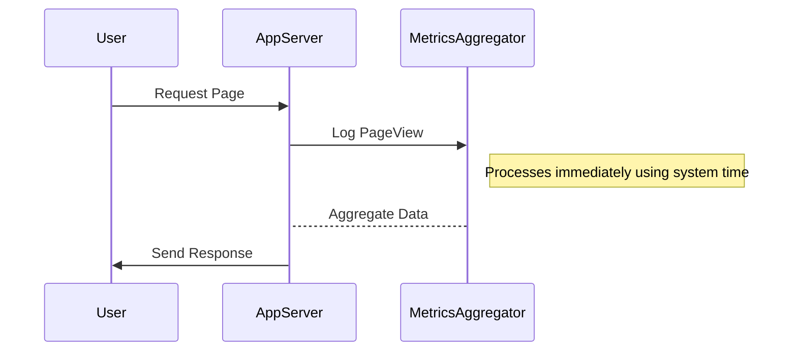

## Overview

The **Processing Time Processing** pattern addresses how streaming applications handle events using the system clock. Processing time refers to the time at which data events are processed relative to the machine clock without considering the time when the event actually occurred. This simplicity can be advantageous but generally leads to inaccuracies for scenarios requiring precise timing.

## Pattern Details

- **Processing Time**: Events are processed according to the arrival time on the system clock, independent of the actual event occurrence time.
- **Advantages**: 
  - Simplicity: easy to implement and manage because it does not require time synchronization.
  - Performance: generally offers high throughput and low latency since it does not rely on buffering or complex timestamp management.
- **Disadvantages**:
  - Inaccuracy: results may be skewed when events arrive late or out of order.
  - Not ideal for use cases that require accurate time-based data (e.g., financial transactions, real-time analytics).

## Example Use Cases

- **Website Traffic Monitoring**: Count web page views per minute according to when the server logs the request. This approach is suitable for non-critical measurements such as performance monitoring where precision is not strictly necessary.
- **Operational Metrics**: General system-health indicators, such as the number of requests processed per second, which prioritize simplicity over accuracy.

## Example Code

Below is an example using Apache Flink, a popular stream processing framework:

```java
// Import dependencies
import org.apache.flink.streaming.api.environment.StreamExecutionEnvironment;
import org.apache.flink.streaming.api.datastream.DataStream;
import org.apache.flink.streaming.api.windowing.time.Time;

public class ProcessingTimeExample {
    public static void main(String[] args) throws Exception {
        final StreamExecutionEnvironment env = StreamExecutionEnvironment.getExecutionEnvironment();

        // Create a DataStream containing page views
        DataStream<String> pageViews = env.socketTextStream("localhost", 9000);

        // Process with processing time windowing
        DataStream<Long> counts = pageViews
                .map(value -> 1L)
                .timeWindowAll(Time.minutes(1))
                .sum(0);

        counts.print();

        env.execute("Processing Time Example");
    }
}
```

## Diagram

Visualizing the Processing Time Processing pattern:



## Related Patterns

- **Event Time Processing**: Processes events according to the time they actually occurred, more suitable for accurate time-sensitive applications.
- **Ingestion Time Processing**: Uses the time when the event enters the system rather than when it is processed thoroughly.

## Additional Resources

- [Apache Flink Documentation on Time and Windows](https://nightlies.apache.org/flink/flink-docs-release-1.14/docs/dev/datastream/operators/windows/)
- [Google Cloud's Stream Processing Solutions](https://cloud.google.com/dataflow/docs/concepts/streaming-in-depth)
- [Understanding Event Time and Processing Time in Stream Processing Systems](https://www.confluent.io/blog/event-time-processing-versus-processing-time-event-time-matters/)

## Summary

The Processing Time Processing pattern finds wide use in scenarios where simplicity and low latency are paramount, and temporal precision is not strictly required. It is distinct from event time processing owing to its reliance on system clocks instead of event-specific timestamps, making it less suitable for applications that demand strict time correlations. This pattern continues to be valuable in applications like general operational metrics and coarse-grained traffic monitoring.
