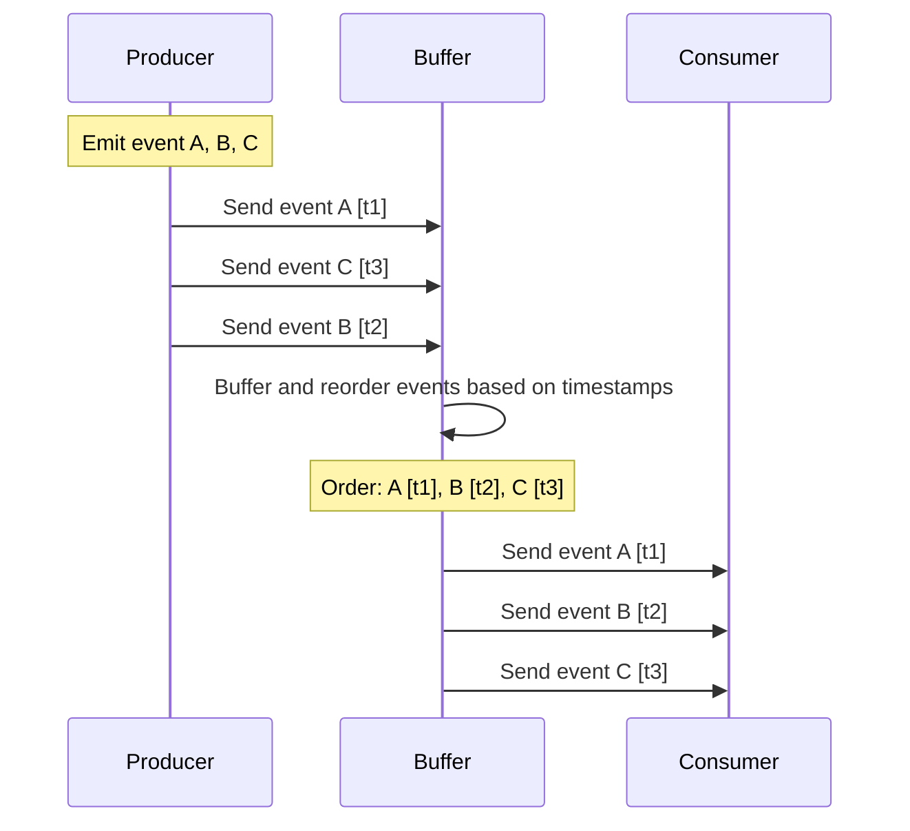

## Introduction

Event Time Ordering is a design pattern used in stream processing systems to reorder events based on their event time. This pattern is particularly useful in scenarios where the correct sequence of events is crucial for processing, such as computations that rely on temporal ordering or causality amongst events.

## Explanation

In distributed environments, events can arrive out of order due to network delays, asynchronous message delivery, and processing latencies. Therefore, events are often processed based on their arrival time or processing time, which might lead to incorrect results if the order of occurrence (event time) is significant.

The Event Time Ordering pattern addresses this challenge by reordering events to the correct sequence based on the timestamps denoting when they occurred rather than when they are processed. This approach typically involves:

- **Buffering**: Temporarily storing incoming events in a buffer until a certain condition is met, such as the passage of a watermark—which signifies the bounds of out-of-orderness allowed within the stream.
- **Sorting**: Sorting events from the buffer based on their event timestamps before they proceed to the next stage of processing.

## Diagram



## Example Implementation

Let's consider implementing Event Time Ordering using Apache Flink, which inherently supports event time semantics and watermarks.

```scala
import org.apache.flink.streaming.api.scala._
import org.apache.flink.streaming.api.windowing.time.Time

case class Event(id: String, eventTime: Long)

val env = StreamExecutionEnvironment.getExecutionEnvironment

env.setStreamTimeCharacteristic(TimeCharacteristic.EventTime)

val eventStream: DataStream[Event] = // define your data source

val orderedStream = eventStream
  .assignTimestampsAndWatermarks(new BoundedOutOfOrdernessTimestampExtractor[Event](Time.seconds(5)) {
    override def extractTimestamp(element: Event): Long = element.eventTime
  })
  .keyBy(_.id)
  .timeWindow(Time.seconds(10))
  .process(new MyProcessFunction())

env.execute("Event Time Ordering Example")
```

## Related Patterns

1. **Watermarking**: Used to manage lateness and trigger computations when sufficient events have been observed.
2. **Out-of-Order Handling**: Strategies to handle late-arriving data, such as allowing updates or compensating transactions.
3. **Session Windows**: Another temporal windowing pattern that groups events into sessions, accounting for periods of inactivity.

## Best Practices

- Determine appropriate watermark intervals to balance between latency and accuracy, based on system requirements.
- Ensure time synchronization across distributed systems to maintain consistency of event time.
- Monitor and handle late events to maintain system robustness and data integrity.

## Additional Resources

- [Apache Flink Guide on Time](https://flink.apache.org/learn-flink/time/) 
- [Kafka Streams Time Concepts](https://kafka.apache.org/documentation/streams/)

## Summary

The Event Time Ordering design pattern is essential for applications where the sequence of events as they occurred (real-world time) is vital for processing accuracy. By leveraging this pattern, systems can produce deterministic outputs even in inconsistent network conditions but may introduce some processing latency. Understanding and implementing effective buffering, ordering, and watermarking strategies are critical to making the most of this pattern.
