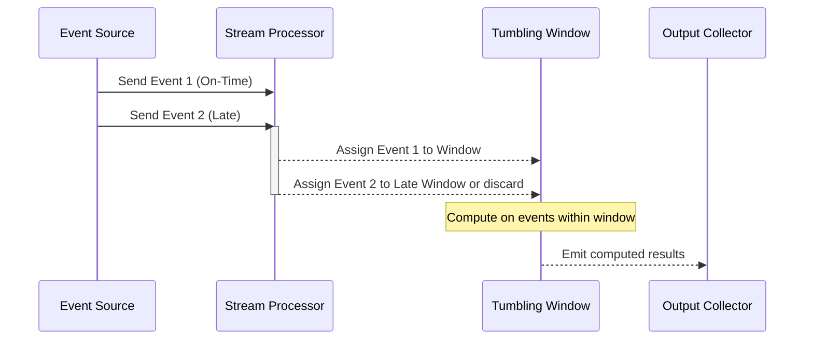

## Overview

In the realm of stream processing, events can be generated and arrive out of chronological order due to network delays, processing lags, or distributed system constraints. The **Max Out-of-Orderness Handling** pattern addresses this challenge by allowing systems to define a maximum allowed lateness or out-of-orderness for events. Events that exceed this predefined threshold are either discarded or handled differently, ensuring that late data does not negatively impact real-time computations.

## Architectural Concepts

Implementing max out-of-orderness handling involves several key steps:

1. **Timestamp Extraction**: Events are often accompanied by timestamps which indicate when the event actually occurred. Extracting and relying on event timestamps (event time) is crucial rather than the time the event is processed (processing time).
   
2. **Defining Allowed Out-of-Orderness**: Establish the maximum interval (e.g., 10 minutes) that an event can arrive late and still be processed normally. This is called the lateness threshold.

3. **Windowing and Triggering**: Use windowing strategies to divide the event stream into manageable chunks. This approach often pairs with triggers that dictate when computations on these windows are executed.

4. **Late Event Handling**: Determine how to handle late arrivals:
   - Discarding them to prevent skewed results.
   - Including them but marking them differently.
   - Storing them for later batch processing.

## Example Code

Using Apache Flink, a popular stream processing framework, as an example:

```java
import org.apache.flink.streaming.api.TimeCharacteristic;
import org.apache.flink.streaming.api.datastream.DataStream;
import org.apache.flink.streaming.api.environment.StreamExecutionEnvironment;
import org.apache.flink.streaming.api.windowing.assigners.TumblingEventTimeWindows;
import org.apache.flink.streaming.api.windowing.time.Time;

public class MaxOutOfOrdernessExample {
    public static void main(String[] args) throws Exception {
        // Set up the execution environment
        final StreamExecutionEnvironment env = StreamExecutionEnvironment.getExecutionEnvironment();
        env.setStreamTimeCharacteristic(TimeCharacteristic.EventTime);

        // Create data stream
        DataStream<Event> stream = ... // source of Event objects

        // Define the maximum out-of-orderness (lateness)
        final long maxOutOfOrderness = 600000; // 10 minutes

        // Process the stream
        stream
            .assignTimestampsAndWatermarks(new BoundedOutOfOrdernessTimestampExtractor<Event>(Time.milliseconds(maxOutOfOrderness)) {
                @Override
                public long extractTimestamp(Event element) {
                    return element.getTimestamp();
                }
            })
            .keyBy(event -> event.getKey())
            .window(TumblingEventTimeWindows.of(Time.minutes(10)))
            .allowedLateness(Time.minutes(10)) // manage lateness
            .sum("valueField")
            .print();

        // Execute the pipeline
        env.execute("Max Out-of-Orderness Handling Example");
    }
}
```

## Diagram



## Related Patterns

- **Time Windowing**: Segmenting streams based on event time to control the granularity of processing.
- **Watermarking**: Estimating lateness in event streams to manage window computation.

## Additional Resources

- [Apache Flink: Event Time and Watermarks](https://flink.apache.org/news/2015/12/04/Introducing-event-time.html)
- [Stream Processing with Apache Kafka: Implementing Event Time Processing](https://kafka.apache.org/22/documentation/streams/developer-guide/dsl.html)

## Summary

Handling out-of-order events is a critical requirement in real-time stream processing systems where accurate results depend on the temporal order of data. By leveraging the **Max Out-of-Orderness Handling** pattern, systems can effectively manage lateness, maintain performance integrity, and ensure that downstream applications receive accurate and consistent insights. This pattern strikes a balance between flexibility and precision in dynamic and distributed data environments.
