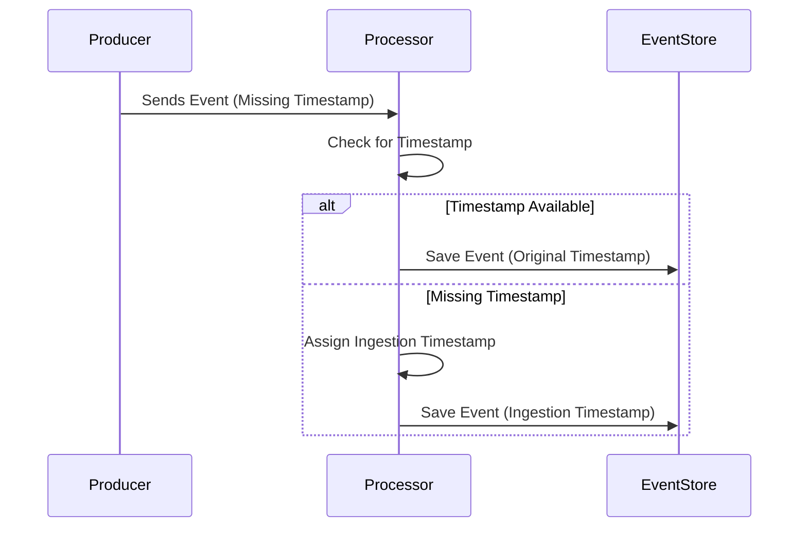

## Introduction

In stream processing, handling events with missing timestamp information is a common challenge. The lack of timestamp data can disrupt processing logic that depends on the event time, like windowing and ordering. This design pattern focuses on strategies to effectively manage such scenarios, ensuring events are either captured with a meaningful time context or dismissed if unusable.

## Detailed Explanation

### Challenges

1. **Inconsistent Time Context**: Without timestamps, events lose the context required for time-based processing, leading to inaccurate insights.
2. **Processing Delays**: Determining when an event should be processed or its relevance can be unclear.
3. **Event Dropping**: Some systems may discard events lacking timestamps, leading to data loss.

### Approaches

1. **Assign Default Timestamps**: Use processing or ingestion time as a fallback when event time is missing. This enables the continued processing of all events and reduces data loss. However, this method may skew time-dependent analyses.
   
2. **Discard Events**: Omit events lacking crucial metadata like timestamps, ensuring data quality at the cost of potential information loss.

3. **Inference Methods**: Utilize historical data or machine learning models to infer possible timestamps. This can maintain data continuity but requires sophisticated infrastructure and validation mechanisms.

4. **User-defined Rules**: Enable users to define rules or functions to dynamically assign timestamps based on additional event attributes or previous event sequences.

### Example Code in Java

```java
import org.apache.flink.api.common.functions.MapFunction;
import org.apache.flink.streaming.api.datastream.DataStream;
import org.apache.flink.streaming.api.environment.StreamExecutionEnvironment;

public class MissingTimestampHandlingExample {
    
    public static void main(String[] args) throws Exception {
        
        StreamExecutionEnvironment env = StreamExecutionEnvironment.getExecutionEnvironment();

        DataStream<String> inputStream = env.socketTextStream("localhost", 9090);
        
        DataStream<Event> eventsWithTimestamps = inputStream
            .map(new AssignTimestamp())
            .filter(event -> event.timestamp != null);

        eventsWithTimestamps.print();

        env.execute("Missing Timestamp Handling Example");
    }

    public static class AssignTimestamp implements MapFunction<String, Event> {
        @Override
        public Event map(String value) {

            Long currentTimestamp = System.currentTimeMillis();
            Long eventTimestamp = extractTimestamp(value);

            // Assign default timestamp if missing
            eventTimestamp = eventTimestamp != null ? eventTimestamp : currentTimestamp;

            return new Event(value, eventTimestamp);
        }

        private Long extractTimestamp(String eventData) {
            // Logic to extract timestamp from event data, could return null
            return null; // Simplified example
        }
    }

    public static class Event {
        public String data;
        public Long timestamp;

        public Event(String data, Long timestamp) {
            this.data = data;
            this.timestamp = timestamp;
        }
    }
}
```

### Diagram

Here is a simplified sequence diagram illustrating a stream processing system assigning ingestion time to events with missing timestamps.



## Related Patterns

- **Event Ordering**: Ensures that events are processed in the correct sequence, crucial when using default timestamps.
- **Late Arrival Handling**: Focuses on processing late-arriving events effectively.

## Additional Resources

- [Apache Flink Documentation on Timestamps and Watermarks](https://nightlies.apache.org/flink/flink-docs-stable/)
- [Kafka Streams Time and Order](https://kafka.apache.org/documentation/streams/)

## Summary

Managing events without timestamps is vital for robust stream processing systems. By employing strategies like assigning default timestamps, discarding, or inferring timestamps, systems maintain event usability, leading to consistent and accurate time-related insights. The choice of strategy depends on the specific requirements and constraints of the processing system.
