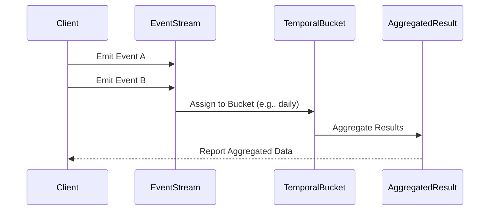

## Temporal Bucketing

### Description

Temporal Bucketing is a stream processing design pattern that involves aggregating or grouping streaming data into fixed time intervals based on event time. This technique is particularly useful for generating time-based analytics and simplifying the complexities involved in processing continuous streams of events.

The key aspect of Temporal Bucketing is the focus on **event time** rather than processing time, which ensures that the data is grouped based on when the events actually occurred, regardless of when they are processed by the system. This leads to more accurate analyses and reports, especially important in scenarios where events may not arrive in the correct temporal order.

### Use Cases

- **Web Analytics**: Aggregating page views or clicks into daily or hourly buckets to provide insights on user activity patterns.
- **Financial Services**: Bucketing transactions into specific intervals to detect anomalies or calculate time-based metrics such as moving averages.
- **IoT Monitoring**: Grouping sensor data into intervals for performance metrics or anomaly detection in real-time systems.

### Example

Consider a streaming platform that handles website visit logs. For daily reporting, it would make sense to group these logs into 24-hour intervals based on the actual visit times, not when the logs are processed:

```java
import org.apache.flink.streaming.api.environment.StreamExecutionEnvironment;
import org.apache.flink.streaming.api.datastream.DataStream;
import org.apache.flink.streaming.api.windowing.time.Time;
import org.apache.flink.streaming.api.windowing.assigners.TumblingEventTimeWindows;

DataStream<Event> eventStream = ... // obtain your stream of events here

DataStream<DailyAggregate> aggregatedStream = eventStream
    .keyBy(event -> event.getType())
    .window(TumblingEventTimeWindows.of(Time.days(1)))
    .apply(new MyAggregationFunction());

// MyAggregationFunction would be your specific logic for aggregating events
```

### Diagram

Here's a simple UML diagram illustrating Temporal Bucketing using the Mermaid syntax:



### Related Patterns

- **Tumbling Windows**: Uses fixed-size, non-overlapping time windows for event grouping, which aligns closely with Temporal Bucketing.
- **Sliding Windows**: Offers overlapping time windows, useful for finer-grained analyses where frequent intervals and aggregate updates are required.
- **Session Windows**: Group by periods of user inactivity; useful for tracking user behavior over uneven time spans.

### Best Practices

- **Handling Late Data**: Implement mechanisms to tolerate late-arriving events, often through watermarking and specifying lateness allowed in the streaming framework.
- **Performance Optimization**: Optimize window size based on use case to balance between data freshness and processing efficiency.
- **Correct Time Coherence**: Ensure synchronization between event time annotations and business logic to avoid misinterpretations of time-based data.

### Additional Resources

- [Apache Flink: Advanced Windowing](https://nightlies.apache.org/flink/flink-docs-release-1.14/docs/dev/datastream/operators/windows/)
- [Google Cloud Dataflow: Windowing Concepts](https://cloud.google.com/dataflow/docs/guides/windowing)
- [Kafka Streams: Time-Based Windowing](https://kafka.apache.org/25/documentation/streams/developer-guide/dsl-api.html#windowed-operations)

### Summary

Temporal Bucketing, a pattern focused on event-time-based grouping, offers robust support for time-oriented analytics and applications. By organizing streams into fixed intervals, analysts and systems can achieve precise event interpretation, accurate anomaly detection, and insightful temporal analytics. Adoption of this pattern, paired with effective data stream handling and state management practices, empowers organizations to harness their time-series data efficiently.
