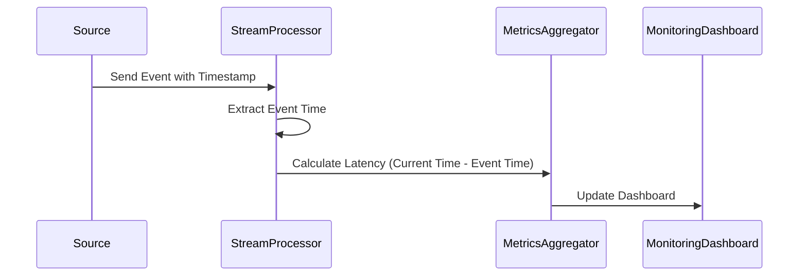

## Event Time Metrics

### Description

Event Time Metrics involve the process of monitoring and analyzing the time at which events occur as recorded by the source system (event time) compared to the time those events are processed by the stream processing system (processing time). This pattern is essential in identifying any latency or delay issues within data streams, enabling better diagnosis of data source problems or network inefficiencies.

### Problems Addressed

- Detecting when data is delayed, allowing real-time systems to compensate or alert for out-of-order data.
- Providing insights into potential network bottlenecks or source system backlogs.
- Enabling more accurate stream processing and time-sensitive computations.

### Architectural Approach

1. **Event Time Extraction**: Extract the event timestamp from each data event as it arrives from the source system.
2. **Timestamp Watermarking**: Ingest data with watermarks to deal with event-time skew and out-of-order tracking.
3. **Latency Calculation**: Compare the event timestamp to the system processing clock to determine event time delays.
4. **Metrics Aggregation**: Compute metrics such as average delay, maximum delay, and delay variance.
5. **Alerting and Dashboarding**: Present relevant metrics on dashboards and trigger alerts based on thresholds.

### Best Practices

- Ensure synchronization between event time extraction and system time to reduce inaccuracies.
- Use scalable stream processing frameworks such as Apache Flink or Kafka Streams for time-bound analysis.
- Define appropriate watermarking strategies to correctly handle varying levels of lateness and event disorganization.
- Regularly analyze metric patterns to adjust network resources or improve source system efficiency.

### Example Code

Here is an example using Apache Flink to calculate event time metrics for a stream:

```java
StreamExecutionEnvironment env = StreamExecutionEnvironment.getExecutionEnvironment();

DataStream<Event> eventStream = env.addSource(new EventSource());

SingleOutputStreamOperator<Tuple2<String, Long>> eventTimeWithDelay = eventStream
    .assignTimestampsAndWatermarks(WatermarkStrategy.<Event>forMonotonousTimestamps()
    .withTimestampAssigner((event, timestamp) -> event.getEventTime()))
    .map(event -> Tuple2.of(event.getId(), System.currentTimeMillis() - event.getEventTime()));

eventTimeWithDelay
    .keyBy(event -> event.f0)
    .process(new DelayCalculator())
    .print();

env.execute("Event Time Metrics Monitoring");

```

### Diagrams



### Related Patterns

- **Watermarking Patterns**: Techniques for handling late and out-of-order data events.
- **Out-of-Order Event Handling**: Strategies for managing streams where event order is not guaranteed.

### Additional Resources

- [Understanding Event Time and Watermarks in Apache Flink](https://flink.apache.org)
- [Event Time Processing in Kafka Streams and ksqlDB](https://kafka.apache.org)
- [Real-time Data Streaming Patterns and Ideal Architectures by Confluent](https://confluent.io/resources)

### Summary

Event Time Metrics are fundamental in stream processing systems to detect and analyze latencies and delays between when events happen and when they are processed. By implementing these metrics, organizations can quickly identify and troubleshoot inefficiencies in their data pipelines, ensuring timely and accurate data processing and decision-making.


