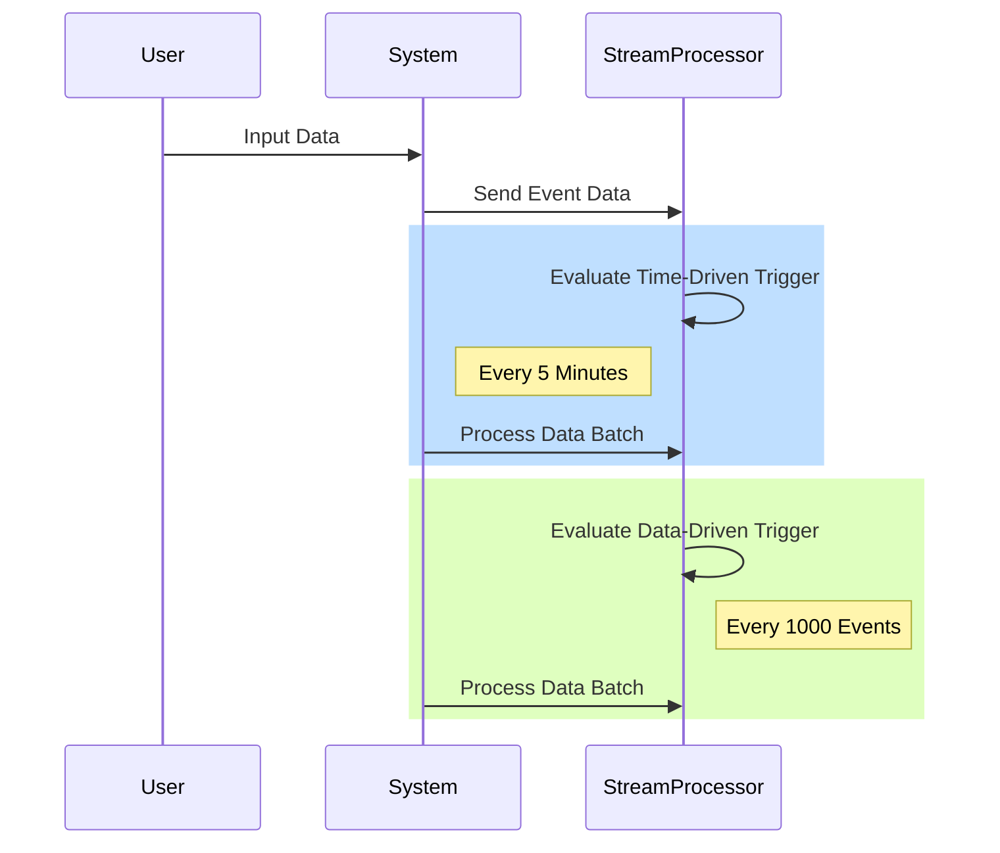

Stream processing applications leverage two primary kinds of triggers for initiating computation or data output: Time-Driven and Data-Driven. These triggers determine how and when operations are applied to an ongoing stream of data. Understanding and selecting appropriate triggers is crucial for optimizing performance and resource usage in real-time data processing systems.

## Architectural Approaches

### Time-Driven Triggers
Time-driven triggers activate at regular temporal intervals. This mechanism typically uses event time, processing time, or ingestion time, which can vary based on business requirements and processing frameworks.

- **Event Time**: Aligns with the notion of time present in the events themselves, allowing processing based on when event data was generated.
- **Processing Time**: Relates to the machine's clock when processing the data, suitable for scenarios where system reaction time to data is prioritized.
- **Ingestion Time**: Marks the time an event enters a system. This combines elements from both event and processing time methods.

**Example Usage**: Calculate average sensor readings every 5 minutes.

### Data-Driven Triggers
Data-driven triggers activate after the accumulation of a specified amount of data or events. This can include count-based thresholds or a composite evaluation of data characteristics.

- **Count-Based**: Initiates processing after receiving a specific number of events.
- **Content-Based**: Driven by data characteristics like exceeding a value or meeting a condition.

**Example Usage**: Process and store data every time 1,000 log entries are collected.

## Designing Trigger Mechanisms

The choice between time-driven and data-driven triggers depends on the particularities of the application needs:

- **Latency vs. Throughput**: Data-driven triggers might lead to higher throughput as they allow bulk processing of batched data, potentially increasing latency. Time-driven triggers may offer lower latency as processing happens at regular intervals.

- **Simplicity vs. Complexity**: Time-driven triggers offer simplicity by eliminating the need to ensure batch size or condition checks compared to the data-driven ones which need more complex state tracking.

### Example Code

Here’s a conceptual example using **Apache Flink**, a stream processing framework that showcases both triggers.

#### Time-Driven Trigger in Flink

```java
DataStream<String> sensorData = ...; // your input data stream

sensorData
    .timeWindowAll(Time.minutes(5))
    .apply(new AggregateFunction());
```

#### Data-Driven Trigger in Flink

```java
DataStream<String> sensorData = ...;

sensorData
    .countWindowAll(1000)
    .apply(new AggregateFunction());
```

## Diagrams

Below is a **Mermaid Sequence Diagram** that illustrates the flow for a simple scenario using both trigger types:



## Related Patterns

- **Windowing**: A related pattern for dividing a data stream into chunks for analysis.
- **Event Time Watermarks**: Helps manage late-arriving data and order correctness in event time processing.

## Additional Resources

- [Apache Flink: Handling Late Events and Watermarking](https://flink.apache.org)
- [Dataflow Triggers: Time and Data](https://cloud.google.com/dataflow/docs/concepts/triggers)
- [Kafka Streams Windowing](https://kafka.apache.org/documentation/streams/)

## Summary

Time-driven and data-driven triggers facilitate tailored performance enhancements and orderly system responses in stream processing architectures. Understanding when and how to deploy these triggers significantly influences system design efficiency, data processing latency, and throughput capabilities. Deliberate consideration and optimal selection drive robust, reliable data-intense applications empowering business intelligence and decision-making in real-time environments.
