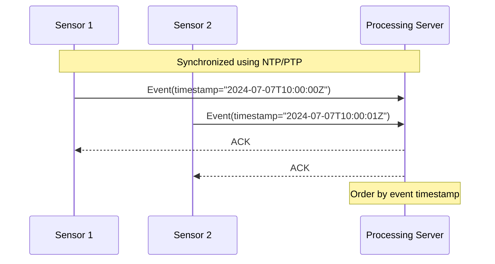

---

linkTitle: "Event Time in Distributed Systems"
title: "Event Time in Distributed Systems: Managing Temporal Consistency"
category: "Event Time vs. Processing Time Patterns"
series: "Stream Processing Design Patterns"
description: "Managing event time across distributed components with varying latencies, ensuring consistent processing by leveraging synchronized clocks and time protocols for comparable event timestamps."
categories:
- event-time-processing
- distributed-systems
- stream-processing
tags:
- event-time
- timestamps
- distributed-components
- stream-processing
- time-synchronization
date: 2024-07-07
type: docs

canonical: "https://softwarepatternslexicon.com/101/5/28"
license: "© 2024 Tokenizer Inc. CC BY-NC-SA 4.0"
---


In distributed systems, especially in the domain of stream processing, the concept of event time plays a crucial role in handling and processing data streams accurately. Event time refers to the point in time at which an event actually occurred, as opposed to processing time, which represents when an event is processed by the system. Event time provides a consistent and repeatable view of when events occurred, enabling more accurate analytical results and data aggregations.

## Description

Event time in distributed systems involves managing timestamps associated with events such that they reflect when the events truly happened, rather than when they are encountered or processed by the system. This becomes particularly challenging in distributed environments due to potential network delays, varying latencies, and the lack of a single global clock.

Accurate event time handling enables correct data processing, time-based aggregations, and windowing operations across distributed components. Synchronization protocols and careful event management are essential to align clocks and ensure timestamp accuracy.

## Example

Consider an IoT application that collects sensor data from various locations, each sending event data over the internet to a centralized processing system. Each sensor attaches a timestamp to its events indicating the moment the data was sensed. However, due to network latencies, these events might arrive out of order or delayed.

Utilizing protocols such as the Network Time Protocol (NTP) or more accurately, the Precision Time Protocol (PTP), systems can synchronize their clocks with high precision, allowing for events from different sensors to be aligned accurately.

```scala
import java.time.Instant

case class SensorEvent(sensorId: String, eventId: String, timestamp: Instant, data: Map[String, Any])

// An example function to process events using event time
def processEvent(event: SensorEvent): Unit = {
  val eventProcessingStartTime = Instant.now()
  // Process the event based on its timestamp
  // ...
  println(s"Processing event ${event.eventId} from ${event.timestamp} at ${eventProcessingStartTime}")
}
```

## Diagrams

Here is an example of a diagram illustrating event time management in distributed systems using synchronized clocks:



## Related Patterns

- **Processing Time Pattern**: Unlike event time, processing time uses the system clock at the time of event processing which can lead to inconsistent results in distributed systems.
- **Watermarks**: These help in managing event time by providing a notion of progress, indicating how far the system has processed in terms of event time.
- **Late Data Handling**: Addressing events that arrive late due to network delays or other factors, ensuring they are still processed accurately.

## Best Practices

- Utilize highly accurate time synchronization methods like PTP for fine-grained clock alignment across distributed systems.
- Implement mechanisms for handling out-of-order events with buffering and sorting based on event time.
- Consider using a stream processing framework like Apache Flink that provides built-in support for event time management and windowing strategies.

## Additional Resources

- [Google Research’s MillWheel: Fault-Tolerant Stream Processing at Internet Scale](http://research.google.com/pubs/pub41378.html)
- [Apache Flink Event Time Guide](https://flink.apache.org/learn-flink/#event-time-processing)
- [The Benefits of Time Travel in Stream Processing with Apache Kafka](https://www.confluent.io/blog/time-travel-stream-processing-apache-kafka)

## Summary

Handling event time in distributed systems is pivotal for ensuring consistency and accuracy in stream processing applications. Leveraging event time allows systems to reproduce historical scenarios or accurately analyze real-time data with respect to the true occurrence of events. The challenges posed by latency and distributed nature require efficient time synchronization and disciplined handling of event data, benefiting from sophisticated frameworks that support such patterns.

By understanding and applying the event time pattern and related methodologies, developers can create robust distributed applications capable of handling time-sensitive data with precision and reliability.
