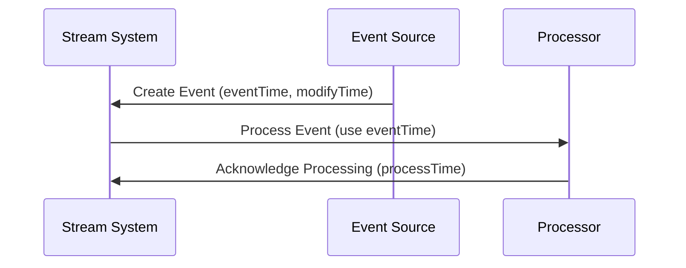

## Description

In stream processing systems, events often carry multiple relevant timestamps, representing different aspects of the event's lifecycle. These timestamps can include the creation time, which is the actual time of the event occurrence, the modification time, which indicates when the event attributes were last updated, and the processing time, which is when the event is processed by the stream processing system. The choice of which timestamp to use for specific data processing tasks is crucial to ensure the accuracy of analytics and auditing operations.

## Architectural Approaches

When designing systems handling events with multiple timestamps, consider the following architectural approaches:

1. **Timestamp Selection**: Define clear criteria or heuristics for selecting which timestamp to use in a given context within the data processing logic. For example, choosing creation time for analytics to maintain consistency with real-world events, and modification time for audit trails to ensure compliance with data integrity requirements.

2. **Event Time Processing**: Employ event time processing in streaming systems to use the original timestamps included within the events, thus providing accurate time-based windowing and aggregations. This typically involves adjusting system clocks to compensate for late or out-of-order events.

3. **Watermarking**: Implement watermarking techniques to handle late-arriving data. Watermarks provide a way to estimate the progress of time and help in determining when windowing operations can be closed safely.

4. **Temporal Data Models**: Design temporal data models that inherently support multiple timestamps. This allows storing, querying, and manipulating multiple time-related attributes effectively.

## Best Practices

- **Comprehensive Data Handling**: Ensure that all possible timestamps in an event are included and properly documented, allowing flexibility and informativeness for future data processing needs.
  
- **Synchronization Across Systems**: Maintain consistent timestamp handling and synchronization across distributed systems to minimize discrepancies caused by network delays and time zone differences.

- **Granularity Management**: Use appropriate time granularity (e.g., seconds, milliseconds) based on the application's requirements to maintain a balance between precision and storage efficiency.

## Example Code

Here's a simple example illustrating how multiple timestamps might be handled using a Scala-based stream processing framework such as Apache Flink:

```scala
case class Event(id: String, eventTime: Long, modifyTime: Long, processTime: Long)

val env = StreamExecutionEnvironment.getExecutionEnvironment

// Input stream with existing processing time semantics
val eventStream: DataStream[Event] = ...

// Assign event time based on event metadata
val timestampExtractor = new AscendingTimestampExtractor[Event] {
  override def extractAscendingTimestamp(event: Event): Long = event.eventTime
}

val eventTimeStream = eventStream
  .assignTimestampsAndWatermarks(timestampExtractor)

// Define window operation using event time
val aggregatedStream = eventTimeStream
  .keyBy(_.id)
  .timeWindow(Time.minutes(5))
  .sum("someField")
```

## Diagrams

### Mermaid UML Sequence Diagram



## Related Patterns

- **Event Time Processing**: Focuses on using event-generated timestamps for processing.
- **Watermarking**: Manages lateness in event processing.
- **Temporal Data Models**: Supports data models with time-based attributes.

## Additional Resources

- [Apache Flink Documentation](https://flink.apache.org/documentation/)
- [Google Cloud Dataflow Model](https://cloud.google.com/dataflow/model)
- [Temporal Data Handling Best Practices](https://www.datastax.com/blog/temporal-data-handling)

## Summary

The Multiple Time Stamps pattern addresses challenges in handling events with various relevant timestamps within stream processing architectures. By selecting appropriate timestamps based on processing needs and employing techniques such as watermarking and event time processing, systems can improve accuracy in analytics, ensure compliance in auditable systems, and enhance overall data integrity.
