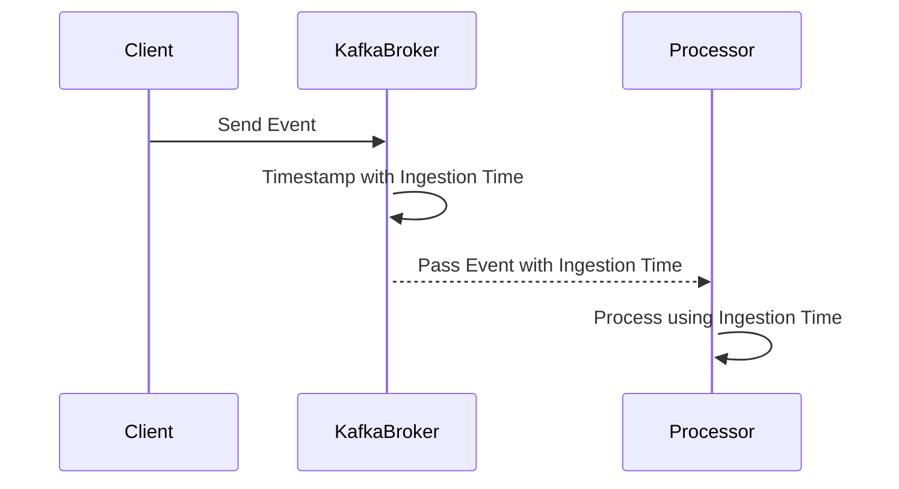

## Introduction

Ingestion Time Processing is a pattern in stream processing that leverages the concept of ingestion time—when events enter a processing system. While distinct from event time (the actual time an event occurred) and processing time (the system clock time when processing occurs), ingestion time provides a pragmatic balance between these two, becoming an ideal choice when event time stamping is not feasible or needed.

By stamping events with the time they are ingested into the system, this pattern enables handling scenarios where event times are absent or unreliable while mitigating the variability introduced by processing time.

## Architectural Overview

### Characteristics

- **Time Marking**: As events enter the system, they are directly stamped with the current system time.
- **Windowing Management**: Ingestion time serves as a reliable basis for creating event windows in streaming applications.
- **Simplicity vs. Complexity**: Offers simplicity over event time processing by eliminating dependencies on external timestamps and is more stable than processing time which can be affected by system lag or clock drift.

### Use Cases

- When event-produced timestamps are not available or are cumbersome to include.
- When the most critical requirement is the consistent latency management than absolute ordering of events.
- Systems requiring fixed consistent slowness due to data characteristic and evolutionary data scenarios, such as log queuing and user interaction tracking.

### Example Implementation

Consider a Kafka-based system for processing log events from distributed user interactions. Upon receiving events into Kafka's broker, assign ingestion timestamps on the events that are later used in downstream consumers for constructing time-based windows.

```java
// Integration with Kafka Streams API
StreamsBuilder builder = new StreamsBuilder();
KStream<String, String> stream = builder.stream("input-topic");

// Assign ingestion time as timestamp
stream.map((key, value) -> new KeyValue<>(key, value))
    .peek((key, value) -> System.out.println("Ingested: " + key + " - " + value))
    .to("output-topic");

// Assign ingestion time in downstream processing
stream.groupByKey()
      .windowedBy(TimeWindows.ofSizeWithNoGrace(Duration.ofMinutes(5)))
      .count();
```

### Diagram: Ingestion Time Process Flow



## Related Patterns and Descriptions

- **Event Time Processing**: Focuses on using the actual time an event occurred, requiring synchronized external timestamps.
- **Processing Time**: Relates to utilizing the system's current time during event processing, heavily influencing real-time applications with low tolerance for latency.

## Additional Resources

- [Apache Kafka Documentation](https://kafka.apache.org/documentation/) – Official resources for implementing Kafka-based ingestion time windowing.
- [Streaming Systems Book](https://www.oreilly.com/library/view/streaming-systems/9781491983874/) by Tyler Akidau et al. covers timing issues in depth.

## Conclusion

Ingestion Time Processing offers a pivotal point for balancing precision with simplicity in streaming data scenarios. It provides a streamlined approach to handling time without external constraints, enabling systems to maintain consistent latency across time-based operations. Whether you are handling user behavior tracking or log aggregation, ingestion time proves a worthy candidate for a variety of applications.
