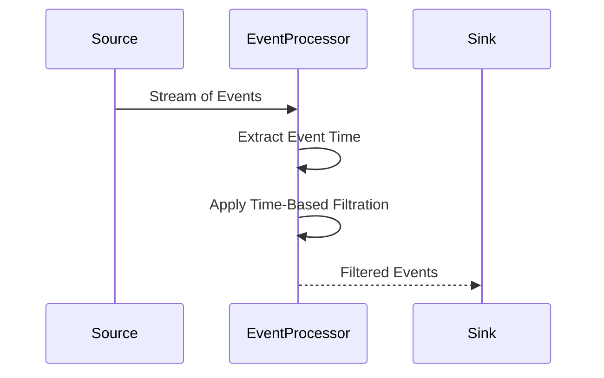

## Introduction

In stream processing systems, handling time-based events requires discerning event time from processing time. The Time-Based Filtration pattern enables filtering events based on their event time to enhance relevance or ensure compliance with data integrity requirements. It is commonly used in scenarios where only events within a specific temporal range are valid or meaningful.

## Problem Statement

In real-time data streams, it's crucial to distinguish relevant events from irrelevant ones. For example, you might need to ignore events that happened before a system's launch or after the close of a reporting period. Without a clear strategy to filter out these events, data integrity and analytical results can be compromised.

## Solution

Time-Based Filtration leverages event-time attributes to decide which events to process and which to discard. By applying a defined time range or condition, only events meeting the temporal criteria are included in subsequent processing or analysis. This pattern enhances data accuracy and minimizes unnecessary load on the system.

## Architectural Approach

- **Event Time Extraction**: Extract the event time from each incoming event. This can be a specific timestamp field within the event payload.
- **Time Window Specification**: Define the permissible time window or condition that determines the relevance of events.
- **Filtration Logic**: Implement logic that discards events falling outside the specified time boundaries before sending them for further processing.

### Example Code

For a practical implementation, consider a scenario using Apache Kafka Streams:

```java
KStream<String, Event> stream = builder.stream("input-topic");

// Define time boundaries
LocalDateTime startTime = LocalDateTime.of(2024, 1, 1, 0, 0);
LocalDateTime endTime = LocalDateTime.of(2024, 12, 31, 23, 59);

// Filter events based on event-time
KStream<String, Event> filteredStream = stream.filter((key, value) -> {
    LocalDateTime eventTime = value.getEventTime();  // Assume Event class has getEventTime()
    return eventTime.isAfter(startTime) && eventTime.isBefore(endTime);
});

// Send filtered events to next processing step
filteredStream.to("filtered-output-topic");
```

### Diagram

Here's a basic sequence diagram illustrating the flow of Time-Based Filtration:



## Related Patterns

- **Time Window Management**: Handling batching, aggregation, or analysis within specific time windows.
- **Event Timestamping**: Ensuring each event is accurately timestamped when originated to ensure correct time-based operations.
- **Late Arrivals Handling**: Managing events that arrive after a designated window closure, crucial for systems with high latency.

## Best Practices

- Synchronize all system clocks across components to maintain consistent event-time processing.
- Employ a robust timestamp extraction and management approach to handle potential time synchronization issues.
- Test the filtration logic with both typical and edge-case temporal scenarios to ensure robustness.

## Additional Resources

- [Stream Processing with Apache Kafka](https://kafka.apache.org/documentation/streams/)
- [Time Management in Distributed Systems](https://queue.acm.org/detail.cfm?id=2745385)

## Summary

Time-Based Filtration is an essential pattern in stream processing, allowing systems to selectively process relevant events by evaluating event-time attributes. This pattern ensures data operations remain focused on meaningful data slices, optimizing both performance and accuracy while maintaining streamlined data pipelines.
