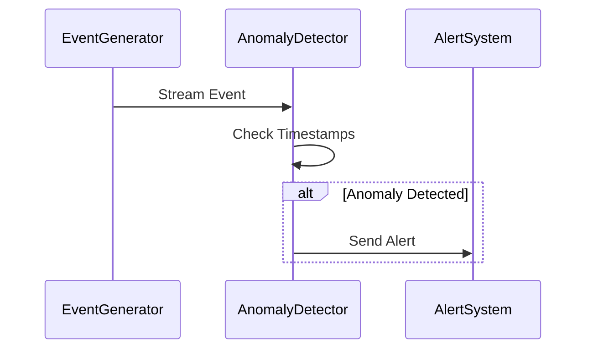

## Overview

The Time-Anomaly Detection pattern is critical in stream processing systems, particularly those relying on precise event timing. In stream processing, event time vs. processing time anomalies can occur due to various factors like network latency, system failures, or skewed data streams. This pattern helps identify and mitigate such irregularities, ensuring that the system's response remains timely and accurate.

## Architectural Approach

Time-Anomaly Detection involves the use of advanced techniques such as:

- **Watermarks and Timers**: These are used to manage event time and detect anomalies by comparing the event times against expected thresholds.
- **Windows and Aggregation**: Logical windows aggregate event data, making it easier to identify outliers or missing events.
- **Heuristic and Statistical Models**: Models can be developed to learn normal patterns of event time data, helping to detect deviations.
- **Machine Learning Algorithms**: Algorithms can be trained to distinguish between normal fluctuations and true anomalies.

## Best Practices

1. **Granular Time Windows**: Use fine-grained time windows to capture the state of the stream at any specific time.
2. **Dynamic Adjustment**: Your system should dynamically adjust to varying levels of granularity and differing time zones.
3. **Error Tolerance**: Implement error tolerance mechanisms to reduce false positives.
4. **Visualization**: Provide clear visual reports of anomaly detection results for rapid human assessment and response.

## Example Code: Using Flink for Time-Anomaly Detection

Considering you are using Apache Flink, here is a Java example for detecting time anomalies:
```java
import org.apache.flink.streaming.api.datastream.DataStream;
import org.apache.flink.streaming.api.environment.StreamExecutionEnvironment;
import org.apache.flink.streaming.api.windowing.time.Time;
import org.apache.flink.streaming.api.windowing.triggers.ProcessingTimeTrigger;
import org.apache.flink.util.Collector;
import org.apache.flink.api.common.functions.FlatMapFunction;

public class TimeAnomalyDetection {
    public static void main(String[] args) throws Exception {
        final StreamExecutionEnvironment env = StreamExecutionEnvironment.getExecutionEnvironment();

        DataStream<String> inputStream = env.socketTextStream("localhost", 9999);

        DataStream<String> anomalies = inputStream
                .flatMap(new FlatMapFunction<String, String>() {
                    @Override
                    public void flatMap(String value, Collector<String> out) throws Exception {
                         // Extract relevant data, process event time based logic
                    }
                })
                .keyBy(value -> someKeyLogic(value))
                .timeWindow(Time.seconds(10))
                .trigger(ProcessingTimeTrigger.create())
                .process(new TimeAnomalyProcessFunction());

        anomalies.print();

        env.execute("Time Anomaly Detection Example");
    }
}

class TimeAnomalyProcessFunction extends ProcessWindowFunction<String, String, String, TimeWindow> {
    @Override
    public void process(String key, Context context, Iterable<String> input, Collector<String> out) throws Exception {
        // Implement anomaly detection logic
    }
}
```

## Diagram: Time-Anomaly Detection Process



## Related Patterns

- **Watermarking**: Provides crucial timing information for latency and out-of-order data handling.
- **Sliding Window**: Allows multiple overlapping time segments to be analyzed for continuous monitoring.
- **Late Data Handling**: Deals with events that arrive after other windows have already been processed.

## Additional Resources

- "Streaming Systems: The What, Where, When, and How of Large-Scale Data Processing" by Tyler Akidau.
- Apache Flink's official documentation on [Watermarks & Windowing](https://nightlies.apache.org/flink/flink-docs-release-1.14/docs/dev/datastream/event-time/).

## Summary

Time-Anomaly Detection is essential for maintaining the integrity of data stream processing systems. By effectively implementing this pattern, systems can detect anomalies that signify potential issues, ensuring the architecture remains robust and responsive to various time discrepancies. It involves using techniques such as watermarks, machine learning models, and precise windowing strategies to anticipate and respond to anomalies swiftly and accurately.
