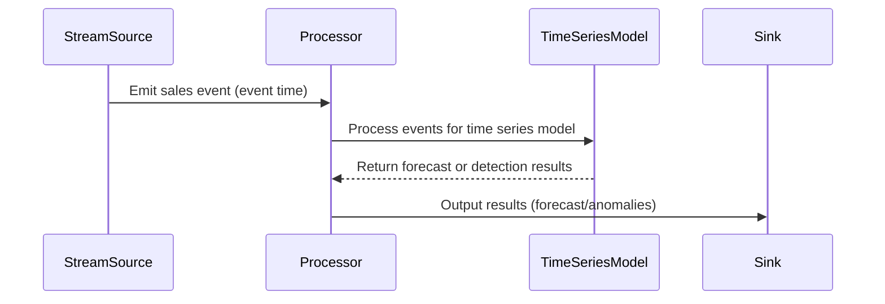

## Introduction to Time Series Analysis

Time series analysis is a specialized form of data analysis focusing on time-ordered data points. In cloud computing and big data platforms, especially in real-time stream processing systems, handling data with a temporal component is crucial for deriving meaningful insights. Time series analysis can serve various applications such as forecasting future values, identifying trends and seasonal patterns, and detecting anomalies within the data.

## Key Concepts

### Event Time vs. Processing Time

1. **Event Time**: This refers to the time at which the event actually occurred, which is often embedded within the data itself. Processing this time accurately is critical in environments where the latency between event generation and event processing varies.

2. **Processing Time**: This is the time at which the event is processed by the system. It's essential to understand both to properly handle late-arriving data and ensure accurate time window calculations.

### Time Series Techniques

- **Forecasting**: Predicting future values based on historical data using models such as ARIMA, exponential smoothing, or machine learning-based approaches.
  
- **Trend Analysis**: Detecting medium to long-term trends within a dataset to understand the direction and scale of changes.

- **Anomaly Detection**: Identifying any unusual or out-of-context points or patterns that deviate from the norm using techniques such as statistical thresholds or machine learning-based anomaly detection models.

## Example Implementation

Consider a streaming platform that consumes sales data to forecast future sales. The following outlines a simplified approach using ARIMA models:

```java
import org.apache.flink.api.java.DataSet;
import org.apache.flink.api.java.ExecutionEnvironment;
import org.apache.flink.api.java.tuple.Tuple2;

// Simplified pseudo-code for time series forecasting with ARIMA
public class TimeSeriesForecasting {
    public static void main(String[] args) throws Exception {
        final ExecutionEnvironment env = ExecutionEnvironment.getExecutionEnvironment();

        // Example DataSet containing timestamp and sales data
        DataSet<Tuple2<Long, Double>> salesData = env.fromElements(
            Tuple2.of(1672425600L, 100.0),
            Tuple2.of(1672512000L, 150.0),
            Tuple2.of(1672598400L, 130.0)
            // additional data points
        );

        // Perform Time Series Forecasting using ARIMA (pseudo-code as the library is hypothetical)
        DataSet<Double> forecastedSales = applyARIMAModel(salesData);

        // Future processing or storage
        forecastedSales.print();
    }

    private static DataSet<Double> applyARIMAModel(DataSet<Tuple2<Long, Double>> salesData) {
        // This method will contain ARIMA logic
        return salesData.map(value -> predictNextValue(value.f1));
    }

    private static Double predictNextValue(Double currentValue) {
        // Placeholder for actual ARIMA logic
        return currentValue + Math.random(); // Random forecast for demonstration
    }
}
```

## Diagram

Here’s a simple UML sequence diagram illustrating event processing through a time series analysis pipeline:



## Related Patterns

- **Event Sourcing**: This pattern involves storing state changes as a sequence of events, which can be beneficial for re-processing events with updated time series models.

- **CQRS (Command Query Responsibility Segregation)**: Useful for separately handling command update operations and query operations, especially when dealing with time series queries and updates.

## Additional Resources

- *Time Series Analysis and Its Applications: With R Examples* by Shumway and Stoffer
- Flink and Kafka documentation for real-time data processing architectures
- ARIMA and machine learning libraries such as Statsmodels (Python) and Apache Spark's MLlib

## Summary

Time series analysis in cloud computing environments enables organizations to leverage event-time data for valuable insights into future trends, potential anomalies, and significant patterns. Applying appropriate techniques and managing event time carefully fortifies the analysis's accuracy, enabling informed decision-making in dynamic and temporal datasets. Through proper design patterns and real-time architectures, enterprises can effectively harness the power of time series analysis within their data processing ecosystems.
