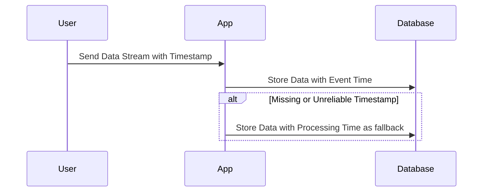

## Introduction

In modern data-driven applications, the timeliness and accuracy of data processing are crucial. The Hybrid Time Processing pattern addresses the challenges associated with data streams by combining event time and processing time. This allows systems to process data based on the recorded time of the event or fallback to processing time when the event's timestamp is missing or unreliable.

## Detailed Explanation

### Event Time vs. Processing Time

- **Event Time** refers to when the event occurred, and it is part of the data itself. It provides high accuracy, especially with out-of-order or delayed data, but depends on the data source to supply reliable timestamps.
- **Processing Time** is the time at which the event is processed by the system. It's easier to obtain but can lead to inaccuracies, especially in distributed systems where data can arrive asynchronously.

### Hybrid Time Processing Approach

By leveraging both event and processing times, applications can improve reliability and robustness. Conditions or rules within the system can determine whether to use event time or processing time based on data quality and system requirements.

- **Adaptive Switching**: Dynamically switches between event and processing times based on the presence and reliability of event timestamps.
- **Resilience to Missing Data**: Fall back to processing time when event time is unavailable.
- **Handling Data Drift and Outliers**: Use event times for normal conditions and processing times when data drift or outliers are detected.

### Architectural Approaches

1. **Stream Processing Frameworks**: Implement frameworks like Apache Flink or Apache Kafka Streams which support handling both event-time and processing-time semantics effectively.
2. **Adaptive Rules Engines**: Design rules engines capable of dynamically choosing between time schemes based on conditions detailed in configurations and forecasts.
3. **Monitoring and Feedback Loops**: Add feedback loops to continuously monitor data quality and quantity to ensure decisions in the time swap mechanism are optimal.

## Example Code

Below is an example using Apache Flink for Hybrid Time Processing:

```scala
import org.apache.flink.streaming.api.scala._
import org.apache.flink.streaming.api.TimeCharacteristic

val env = StreamExecutionEnvironment.getExecutionEnvironment
env.setStreamTimeCharacteristic(TimeCharacteristic.EventTime)

val stream = env.fromElements(
  (Some(1640995200000L), "event1"),
  (None, "event2"),  // Suppose the event timestamp is missing
  (Some(1640998800000L), "event3")
)

val processedStream = stream
  .map(event =>
    event._1 match {
      case Some(eventTimestamp) => (eventTimestamp, event._2)
      case None => (System.currentTimeMillis(), event._2)
    }
  )

processedStream.print()

env.execute("Hybrid Time Processing Example")
```

## Mermaid UML Sequence Diagram



## Related Patterns

- **Out-of-Order Processing Pattern**: Focuses on handling events that arrive out of order, often related to event time semantics.
- **Watermark Generation Pattern**: Employs watermarks to signify event completeness and manage lateness.
- **Late Data Handling Pattern**: Involves strategies like retries and buffering to manage late-arriving data.

## Additional Resources

- "The Data-Driven Application Complexity" by Dean Wampler, which discusses event-driven and time-driven architectures.
- *Stream Processing with Apache Flink* [Link to online resource] for deeper understanding and tutorials on time characteristics.
- [Kafka Streams Documentation](https://kafka.apache.org/documentation/streams/) for implementers using Kafka-based stream processing.

## Final Summary

The Hybrid Time Processing pattern is invaluable for stream processing systems where reliable time tracking is necessary despite potential timestamp unreliability. By adapting processing based on timestamp availability and accuracy, this pattern ensures system robustness and accuracy, thereby supporting diverse and complex real-time data applications.
