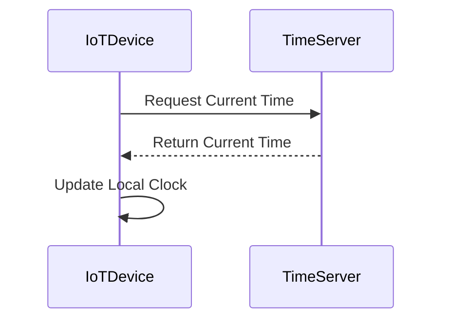

In distributed systems, especially those involving stream processing, maintaining consistent event time processing is crucial. Time Synchronization is an essential pattern that ensures all devices and services in a network have their clocks synchronized. This allows for accurate timestamping and reliable sequencing of events, which is vital for data accuracy and processing efficiency.

## Description

The Time Synchronization pattern involves aligning clocks across all systems participating in a data stream. It mitigates issues arising from time drift where clocks of different nodes diverge, leading to inconsistent event timings. This pattern often employs protocols like the Network Time Protocol (NTP), which provides a way for devices to periodically synchronize their clocks with standard time servers.

### Key Aspects:
- **Accuracy**: Ensures that timestamps reflect the true sequence of occurrences.
- **Consistency**: Prevents discrepancies in event ordering due to time differences across distributed systems.
- **Reliability**: Supports the auditability of events with synchronized timestamps.

## Example

Consider an IoT deployment where numerous sensors collect data and transmit it to a central processing system. If each sensor's clock is not synchronized, the data collected might carry incorrect timestamps, leading to misinterpretation of the events.

```scala
// Example using Scala to poll and synchronize time
import java.time.Instant
import java.net.URL
import scala.io.Source

def fetchNetworkTime(serverUrl: String): Option[Instant] = {
  try {
    val source = Source.fromURL(new URL(serverUrl))
    val timeStr = source.mkString.trim
    source.close()
    Some(Instant.parse(timeStr))
  } catch {
    case _: Exception => None
  }
}

val ntpServerUrl = "http://worldtimeapi.org/api/timezone/Etc/UTC"
val currentTime = fetchNetworkTime(ntpServerUrl).getOrElse(Instant.now())
println(s"Synchronized time: $currentTime")
```
In this example, the IoT device synchronizes its clock with a network time server, ensuring accurate time reporting for sensors.

## Diagrams

A simple sequence diagram showing time synchronization with a time server might look like the following:



## Related Patterns

- **Event Sourcing**: Involves storing a sequence of event slices that can be reprocessed to rebuild state. Time synchronization ensures the sequence remains accurate.
  
- **Rate Limiting Pattern**: Often requires accurate timing data to limit requests effectively, relying on synchronized clocks.

- **Windowing Operations**: In stream processing, operations on event windows depend on accurate time synchronization to define window boundaries.

## Additional Resources

- [NTP: The Network Time Protocol](http://ntp.org): Official website providing resources on time synchronization protocols.
- *Designing Data-Intensive Applications* by Martin Kleppmann: A comprehensive book covering the handling of time in distributed systems.
- [Worldtime API](http://worldtimeapi.org): A third-party service that can be used for accessing current time in different zones over HTTP.

## Summary

The Time Synchronization pattern is foundational for distributed systems where event ordering and timing integrity are paramount. Using protocols like NTP ensures that all nodes in the system operate on a consistent timeline, which is critical for processes such as stream processing or IoT data collection. Implementing this pattern yields increased reliability, consistency, and efficiency across the whole system.
